```{r global_options, include=FALSE}
knitr::opts_chunk$set(tidy=TRUE, results='hold', fig.align='center')
```

# Names and Values
## Prerequisites
We'll use the development version of the lobstr package and the CRAN pryr package to dig into the memory representation of R objects and to pry back the surface of R and dig into the details.

```{r, echo=FALSE, include=FALSE}
# devtools does not seem to work with R 3.5.0. Below is a workaround - see https://github.com/r-lib/devtools/issues/1772
# library(devtools)
# assignInNamespace("version_info", c(devtools:::version_info, list("3.5" = list(version_min = "3.3.0", version_max = "99.99.99", path = "bin"))), "devtools")
# find_rtools()
# devtools::install_github("r-lib/lobstr")
library(lobstr)
# pryr package also provides tools to pry back the surface of R and dig into the details
library(pryr)
```

## Binding basics
Take this code:

```{r}
x <- 1:3
```

It is easy to read this code as: "create an object named 'x', containing the values 1, 2, and 3".
It's more accurate to think about this code as doing two things:

* Creating an object, a vector of values, `1:3`.
* Binding the object to a name, `x`.

Note that the object, or value, doesn't have a name; it's the name that has a value.You can think  of a name as a refence for a value.
For example, if you run this code you don't get another copy of the value `1:3`.

```{r}
x <- 1:3
y <- x
lobstr::obj_addr(x)
lobstr::obj_addr(y)
pryr::address(x)
pryr::address(y)
```

As can been seen, both `x` and `y` point to the same location in memory.

```{r, out.width="200px", echo=FALSE}
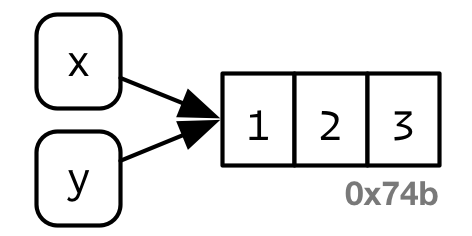
```
    
### Non-syntactic names
A **syntactic** name must consist of letters^[Surprisingly, what consitutes a letter is determined by you current locale. That means that the synax of R code actually differs from computer to computer, and it's possible for a file that works on one computer to not even parse on another!], digits, `.` and `_`, and can't begin with `_`, a digit, or `.` followed by a digit. Additionally, it can not be one of a list of  **reserved words** like `TRUE`, `NULL`, `if`, and `function` (see the complete list in `?Reserved`). Names that don't follow these rules are called **non-syntactic** names, and if you try to use them you'll get an error.

```{r, error=TRUE}
_abc <- 1
```

```{r, error=TRUE}
if <- 10
```

It is possible to override the usual rules and use a name with any sequence of characters by surronding the name with backticks:

```{r, error=TRUE}
`_abc` <- 1
print(`_abc`)

`if` <- 10
print(`if`)
```

Typically, you won't deliberately use such crazy names. Instead you need to understand them because you'll be subjected to them by others - this happens most commonly when you load data that has been created outside of R.

### Exercises
1. Explain the relationsip between `a`, `b`, `c` and `d` in the following code:  
```
a <- 1:10
b <- a
c <- b
d <- 1:10
```
**A**: `a`, `b` and `c` point to the same value/object; `d` points to a different value/object

    ```{r, echo = FALSE}
    a <- 1:10
    b <- a
    c <- b
    d <- 1:10
    ```
    ```{r}
    address(a)
    address(b)
    address(c)
    address(d)
    ```

2. The following code accesses the mean function in multiple different ways. Do they all point to the same underlying function object? Verify with `lobstr::obj_addr`.  
```
mean
base::mean
get("mean")
evalq(mean)
match.fun("mean")
```
**A**: Yes, they all point to the same underlying function object.
    ```{r}
    obj_addr(mean)
    obj_addr(base::mean)
    obj_addr(get("mean"))
    obj_addr(evalq(mean))
    obj_addr(match.fun("mean"))
    ```
    Note that pryr::address doesn't work for function representations 2-5 above:
    ```{r, error = TRUE, results='markup'}
    address(mean)
    address(base::mean)
    address(get("mean"))
    address(evalq(mean))
    address(match.fun("mean"))
    ```    
    However, there is a workaround:
    ```{r}
    x1 <- mean
    address(x1)
    x2 <- base::mean
    address(x2)
    x3 <- get("mean")
    address(x3)
    x4 <- evalq(mean)
    address(x4)
    x5 <- match.fun("mean")
    address(x5)
    ```    

3. By default, base R data import functions, like `read.csv()`, will automatically convert non-syntactic names to syntactic names. Why might this be problematic? What option allows you to suppress this behaviour?  
**A**: This might be especially problematic in non-interactive R usage, when R reads and writes data and the output is expected to contain the same names as used in the data source. Name conversion can be supressed by setting the `check.names` argument to `FALSE`.

4. What rules does `make.names()` use to convert non-syntactic names into syntactic names?  
**A**: The character "X" is prepended if necessary. All invalid characters are translated to ".". A missing value is translated to "NA". Names which match R keywords have a "." appended to them. Duplicated values are altered by `make.unique` if specified.
    ```{r}
    str(make.names)
    ```
    ```{r}
    str(make.unique)
    ```
    ```{r}
    names <- c(".1x", "if", "x!%*", NA, "", ".1x")
    make.names(names)
    make.names(names, unique = TRUE)
    ```
    Note that `NA` is converted to "NA.". That is because it is first converted to "NA", which is an R keyword, so a "." is appended.
    ```{r}
    names <- c("x", "x")
    make.unique(names)
    make.unique(names, sep = "_")
    make.names(names)
    make.names(names, TRUE)
    ```
    

5. Why is `.123e1` not a syntactic name? Read `?make.names`.  
**A**: Because it starts with a `.` followed by a digit. 

## Copy-on-modify
Consider the following code, which binds `x` and `y` to the same underlying value, then modifies `y`.

```{r}
x <- 1:3
y <- x
y[3] <- 4
x
```

While the value associated with `y` changes, the original object does not. Instead, R creates a new object with one value changed, then rebinds `y` to that object.

```{r, out.width="200px", echo=FALSE}
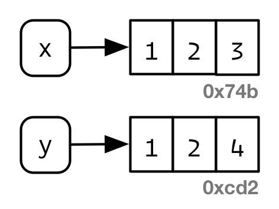
```

This behaivour is called **copy-on-modify**. There are a couple of important exceptions to copy-on-modify - see [Modify-in-place].

### tracemem()
You can see when an object gets copied with the help of `base::tracemem()`.

```{r, results='markup'}
x <- 1:3
str(x)
tracemem(x)
y <- x
y[3] <- 4L
y[3] <- 5L # y is not copied
untracemem(x)
z <- y
z[3] <- 6L
w <- x
w[3] <- 4L # x was not being traced
untracemem(y)
untracemem(z)
z[3] <- 7.5 # z is not being traced. If it were, a copy would occur as z[3] is now numeric, not an integer
str(z)
```

### Function calls
The same rules for copying also apply to function calls. Take this code:

```{r}
f <- function(a) {
  a
}
```
```{r}
x <- 1:3
tracemem(x)
z <- f(x)
z
untracemem(x)
```

While `f()` is running, `a` inside the function will point to the same value as `x` does outside of it:

```{r, out.width="200px", echo=FALSE}
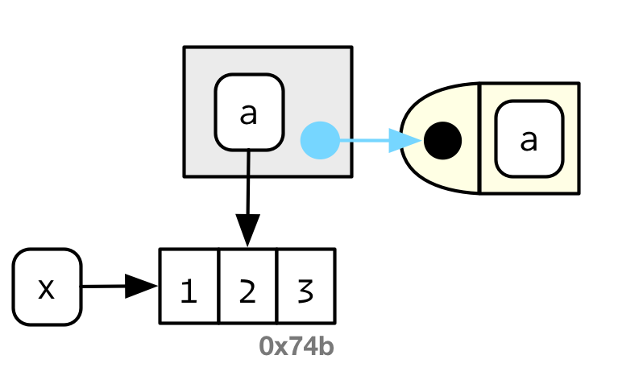
```

And once complete, `z` will point to the same object.

```{r, out.width="200px", echo=FALSE}
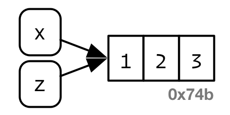
```

```{r}
address(x)
address(z)
```


If `f()` were to modify `x`, R would create a new copy, and then `z` would bind to that object.

```{r}
f <- function(a) {
  a[3] <- 4L
  a
}
```
```{r, results='markup'}
x <- 1:3
tracemem(x)
z <- f(x)
z
untracemem(x)
```
```{r}
address(x)
address(z)
```

### Lists
It's not just names (i.e. variables) that point to values; the elements of a list do too. Take this list, which is superficially very similar to the vector above:

```{r}
l1 <- list(1, 2, 3)
```

The internal representation of the list is actually quite different to that of a vector. A list is really a vector of references:

```{r, out.width="200px", echo=FALSE}
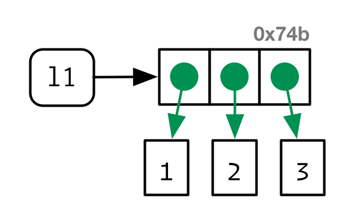
```

This is particularly important when we modify a list:

```{r}
l2 <- l1
```

```{r, out.width="200px", echo=FALSE}
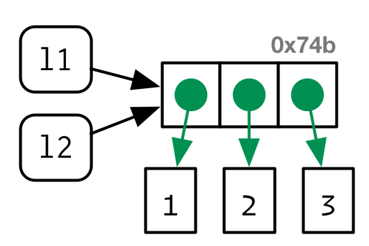
```

```{r}
l2[[3]] <- 4
```

```{r, out.width="200px", echo=FALSE}
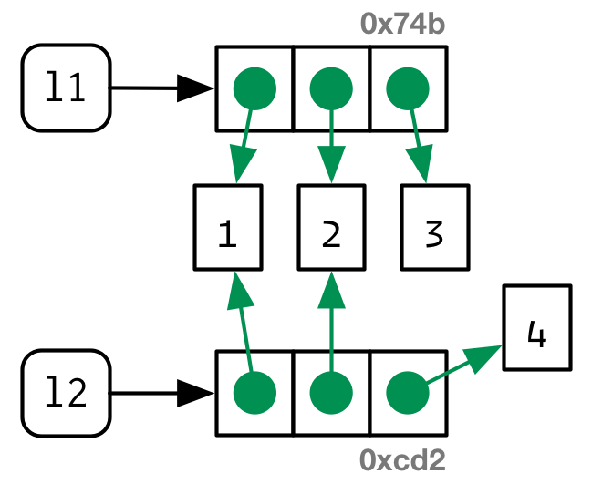
```

Like vectors, lists are copied-on-modify; the original list is left unchanged, and R creates a modifed copy. Note that the copy is **shallow**: the list object and its bindings are copied, but the values pointed to by the bindings are not.

You can use `lobstr::ref()` to see values that are shared across lists. `ref()` prints the memory address of each object, along with a local id so that you can easily cross-reference shared components.

```{r}
lobstr::ref(l1, l2)
```

Consider this code:

```{r}
l1 <- list(1,2)
l2 <- list(3,4)
l <- list(l1, l2)
lc <- l
lobstr::ref(l, lc)
```

Both names, `l` and `lc`, are bound to the same object. Now take this code:

```{r}
lc[[1]][[1]] <- 5
lobstr::ref(l, lc)
```

`lc[[1]][[1]]` and its ancestors are copied from `l`, while the rest of the `lc` is bound to the same objects as `l`. Specifically:

* List `lc` has a different address from `l` - local ids 1 and 8
* List `lc[[1]]` (i.e. '`l1`') has a different address from `l[[1]]` - local ids 2 and 9
* Dbl `lc[[1]][[1]]` has a different address from `l[[1]][[1]]` - local ids 3 and 10
* Dbl `lc[[1]][[2]]` has the same address as `l[[1]][[2]]` - local id 4
* List `lc[[2]]` (i.e. '`l2`') has the same address as `l[[2]]` - local id 5

### Data frames
Data frames are lists, so copy-on-modify has important consequences when you modify a data frame. Take this data frame as a example:

```{r}
d1 <- data.frame(x = c(1, 5, 6), y = c(2, 4, 3))
```

```{r, out.width="200px", echo=FALSE}
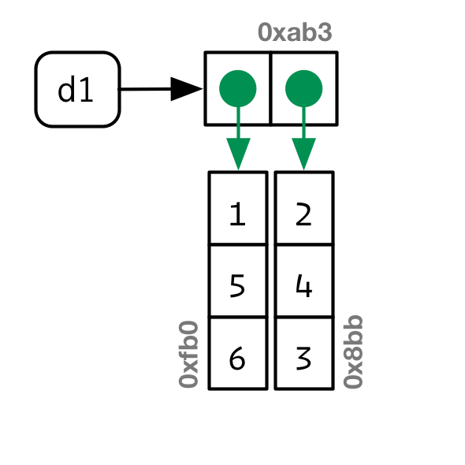
```

If you modify a column, only that column needs to be modified; the others can continue to point to the same place:

```{r}
d2 <- d1
d2[, 2] <- d2[, 2] * 2
```

```{r, out.width="200px", echo=FALSE}
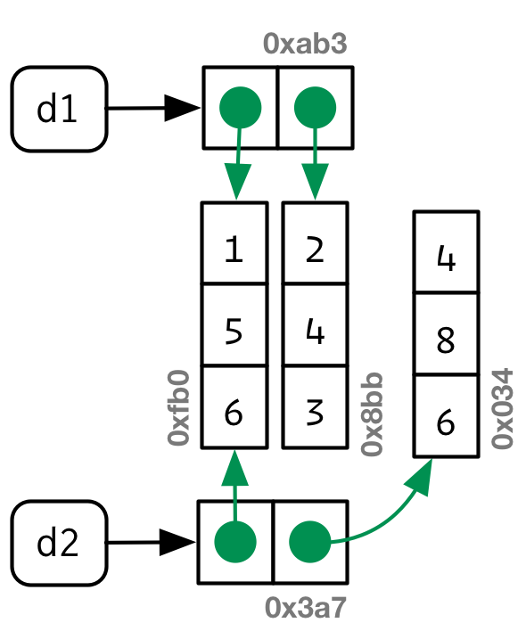
```

However, if you modify a row, there is no way to share data with the previous version of the data frame.

```{r}
d3 <- d1
d3[1, ] <- d3[1, ] * 2
```

```{r, out.width="200px", echo=FALSE}
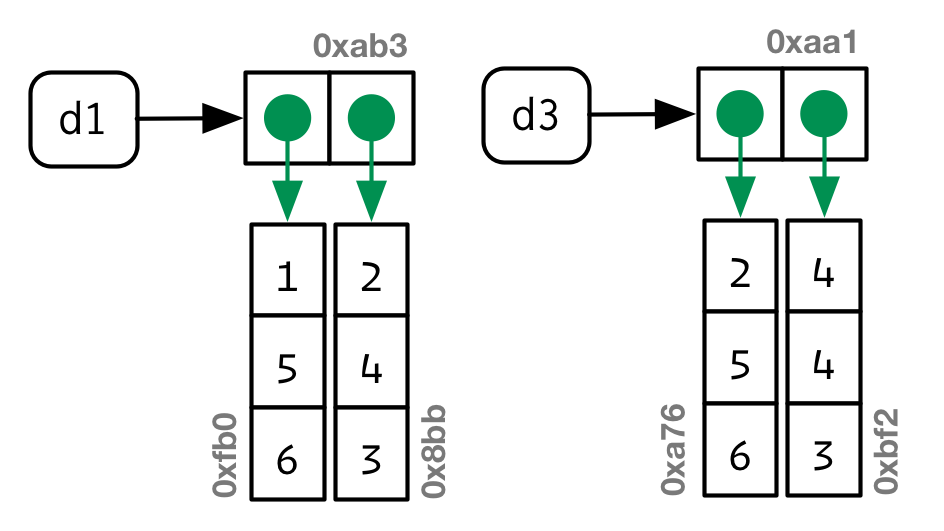
```

If you modify a single element of a column that is an atomic vector, then the entire column is copied:

```{r}
d1 <- data.frame(x = c(1, 5, 6), y = c(2, 4, 3))
d2 <- d1
d2[1,2] <- 7
lobstr::ref(d1, d2)
```

However, this is not true if a column is not an atomic vector. Since a data frame is a list of vectors, and a list is a vector, it is possible for a data frame to have a column that is a list:

```{r, results='markup'}
df1 <- data.frame(x = I(list(1:2, 1:3)))
print(df1)
df2 <- df1
df2[1,1][[1]] <- list(4:5)
print(df2)
lobstr::ref(df2, df1)

```
 
*When a list is given to* `data.frame()`, *it tries to put each item of the list into its own column. A workaround is to use* `I()` *which causes* `data.frame()` *to treat the list as one unit.*

### Character vectors
R uses references in character vectors. We draw character vectors like this:

```{r}
x <- c("a", "a", "abc", "d")
```
```{r, out.width="200px", echo=FALSE}
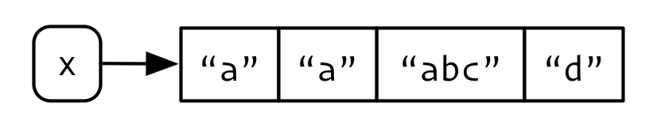
```

This is a polite fiction because R has a **globl string pool**. Each element of a character vector is acutally a pointer to a unique string in that pool:

```{r, out.width="200px", echo=FALSE}
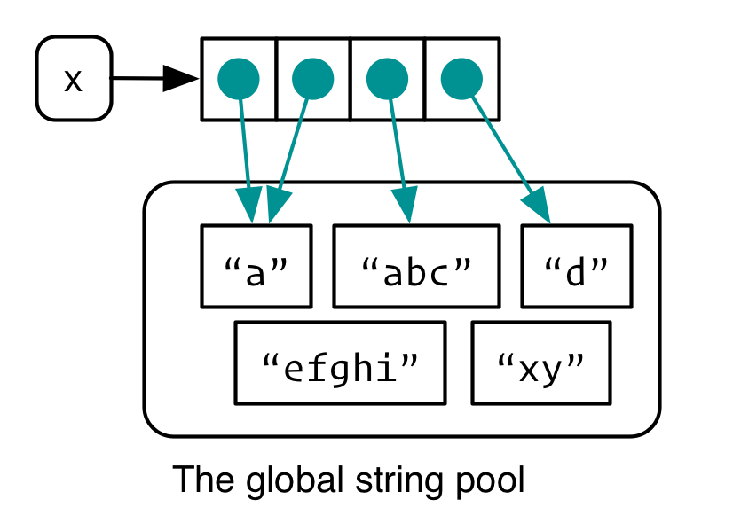
```

You can request that `ref()` show these references:

```{r}
ref(x, character = TRUE)
```

### Exercises
1. Why is `tracemem(1:10)` not useful?  
**A**: Without a binding `1:10` will not stay in memory.

2. Explain why `tracemem()` records two copies when you run this code.  
```
x <- 1:3
tracemem(x)
x[[3]] <- 4
```
**A**: Initially `x` is an integer vector. Within the replacement call, we assign a double to the third element of `x`. So besides the new value of the third element, a type conversion (coercion) is also triggered affecting whole vector.

3. Sketch the relationship between the following objects:
```
a <- 1:10
b <- list(a, a)
c <- list(b, a, 1:10)
```
`a`, the two elements of `b`, and the second element of `c` all point to the same object `1:10`. Additionally, the first element of `c` points to `b` (whose two elements point to the same `1:10`).      
    ```{r, include=FALSE}
    a <- 1:10
    b <- list(a, a)
    c <- list(b, a, 1:10)
    ```
    ```{r}
    ref(a,b,c)
    ```

4. What happens when you run this code?  
```
x <- list(1:10)
x[[2]] <- x
```
**A**: When `x` is bound, it will point to a list (local id 1) of one element (local id 2) which points to `1:10`.
    ```{r}
    x <- list(1:10)
    ref(x)
    ```
When `x` has an `x` appended to itself, it will point to a new list (local id 1) of two elements (local ids 2 and 3). Element with local id 2 points to the same `1:10` object as before. Element with local id 3 points to the prior list object (which had local id 1).
    ```{r}
    x[[2]] <- x
    ref(x)
    ```
    ```{r, out.width="300px", echo=FALSE}
    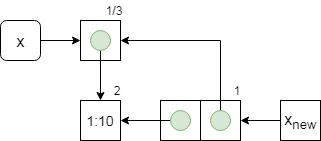
    ```


## Object size
You can find out how much space an object occupies in memory with various functions.

```{r}
lobstr::obj_size(letters)
pryr::object_size(letters)
utils::object.size(letters)
```

```{r}
x <- 1:1e6
y <- list(x, x, x)

lobstr::obj_size(x)
lobstr::obj_size(y)
```
```{r}
pryr::object_size(x)
pryr::object_size(y)
```
```{r}
utils::object.size(x)
utils::object.size(y)

```

Using `lobstr::obj_size()`, `y` is only 72 bytes bigger than `x`. That's the size of an empty list with three elements:

```{r}
lobstr::obj_size(list(NULL, NULL, NULL))
```

Note that `utils::object.size()` incorrectly counts `x`three times.
`obj_size(x) + obj_size(y)` will only equal `obj_size(x, y)` if there are no shared values. Here, the combined size of `x` and `y` is the same as the size of `y`.

```{r}
obj_size(x)
obj_size(y)
obj_size(x, y)
```

The global string pool means that character vectors take up less memory than you might expect.
```{r}
banana <- "bananas bananas bananas"
obj_size(banana)
obj_size(rep(banana, 100))
```

### Exercises
1. Take the following list. Why is its size somewhat misleading?  
```
x <- list(mean, sd, var)
obj_size(x)
```
**A**: The list contains pointers to the functions, but `obj_size()` includes the size of the functions.
    ```{r}
    x <- list(mean, sd, var)
    obj_size(x)
    obj_size(x) - obj_size(mean, sd, var)
    obj_size(list(NULL, NULL, NULL)) # Size of an empty list of 3 elements
    ref(mean, x[[1]])
    ```

2. Predict the output of the following code:  
```
x <- 1e6
obj_size(x)
```
**A**: R does not have a scalar type, only vectors. The amount of space to store an empty vector is 40 B. Each integer inside the vector requires 4B, with R allocating memory in 8B increments. Hence `x` requires 40 B + 1,000,000 * 4 B = 4,000,040 B.
    ```{r}
    obj_size(integer(0))
    obj_size(integer(1))
    obj_size(integer(2))
    obj_size(integer(3))
    obj_size(integer(4))
    x <- 1:1e6
    obj_size(x)
    ```
And this code:
```
y <- list(x, x)
obj_size(y)
obj_size(x, y)
```
**A**: An empty list requires 40 B; each elements requires 8 B. `x` requires 4,000,040 B, hence `y` requires 4,000,096 B. Since `y` contains pointers to `x`, the memory requirement for `x` and `y` is the same as `y`.
    ```{r}
    lobstr::obj_size(list()) # 40 B for an empty list
    pryr::object_size(list()) # note that the pryr package calculated an empty list at 48 B
    
    obj_size(list(NULL)) # 48 B for a list and a pointer
    obj_size(list(integer(0))) # 88B for a list (40 B), a pointer (8 B), and an empty vector (40 B)
    obj_size(list(1L)) # 96B for a list, a point, and a vector containing a single integer (min allocation is 8 B)
    
    x <- 1:1e6
    y <- list(x, x)
    obj_size(y)
    obj_size(x, y)
    
    ```
And this code:
```
y[[1]][[1]] <- 10
obj_size(y)
obj_size(x, y)
```
**A**: A new object of **doubles** is created, `c(10, 2, 3, ..., 1e6)`. This requires 40 B + 1,000,000 * 8 B = 8,000,040 B. Previously `y` required 4,000,096 B, so `y` now requires 12,000,136 B.
    ```{r}
    y[[1]][[1]] <- 10
    str(y)
    obj_size(y)
    ```
And this code:
```
y[[2]][[1]] <- 10
obj_size(y)
obj_size(x, y)
```
**A**: We have two vectors of doubles each requiring 8,000,040 B. In addtion, the list plus two pointers is 40 B + 16 B = 56B. Hence the total requirement for `y` is 16,000,136 B. `x` and `y` no longer point to any of the same objects. Hence the memory required for both is 4,000,040 B + 16,000,136 B = 20,000,176 B.
    ```{r}
    y[[2]][[1]] <- 10
    obj_size(y)
    obj_size(x, y)
    ```
**Note**: a list is a vector, as is an integer, and so when they are empty they should all require the same memory allocation.
    ```{r}
    obj_size(integer(0))
    obj_size(list())
    obj_size(vector())
    ```

## Modify-in-place
Most of the time, modifying an R object will create a copy. THere are two exceptions:

* Object with a single binding get a special performance optimization.
* Environments are a special type of object that is always modifed in place.

### Object with a single binding
If an object only has a single binding to it, R will modifiy it in place. It's challenging to predict exactly when R will make this optimization. One complication is that whenever you call a regular function, it will make a reference to the object, except specially written C functions, which occurr mostly in the base package. (Also note that the environment browser in RStudio makes a reference to every object created at the command line.) We can use `tracemem()` to empirically determine if a copy has occurred.

### Environments
Environments are always modified in place. This is sometimes referred to as having **reference semantics** because whenever you modify an environment the existing bindings continue to have the same reference.

Take this environment, which we bind to `e1` and `e2`;
```{r}
e1 <- rlang::env(a = 1, b = 2, c = 3)
e2 <- e1
```

```{r, out.width="200px", echo=FALSE}
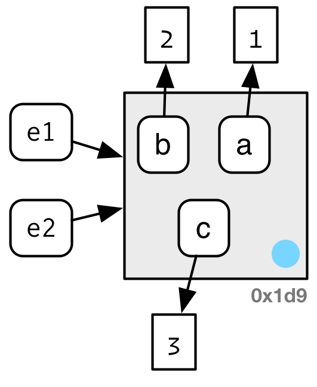
```

If we change a binding, the environment is modified in place:
```{r}
e1$c <- 4
e2$c
```

```{r, out.width="200px", echo=FALSE}
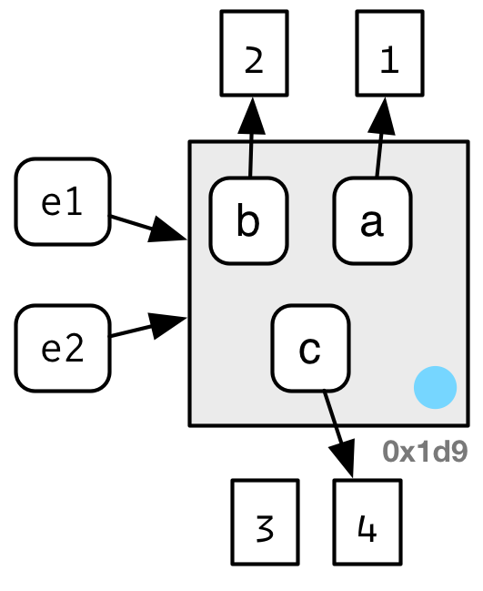
```

One consequence of this is that environments can contain themselves:
```{r}
e <- rlang::env()
e$self <- e
ref(e)
```

```{r, out.width="200px", echo=FALSE}
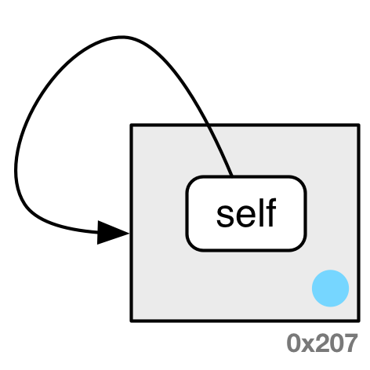
```

### Exercises
1. What happens if you attempt to use `tracemem()` on an environment?  
**A**: As a copy of an environment is never made, `tracemem()` does nothing - in fact, it returns an error.
```{r, error=TRUE}
e1 <- rlang::env(a = 1, b = 2, c = 3)
tracemem(e1)
```

## Copying - Data frames *vs.* lists
Note that replacement for data frames requires 3 copies! A list requires only 1 copy. This is because data frame subsetting is a non-primitive function with complicated subsetting rules, while list subsetting is a primitive function.
```{r, results='markup'}
d <- data.frame(1)
tracemem(d)
d[1] <- 1

l <- list(1)
tracemem(l)
l[1] <- 1

untracemem(d)
untracemem(l)
```
When doing extensive iteration with data frames it might make sense to first convert to a list using `as.list()`.
