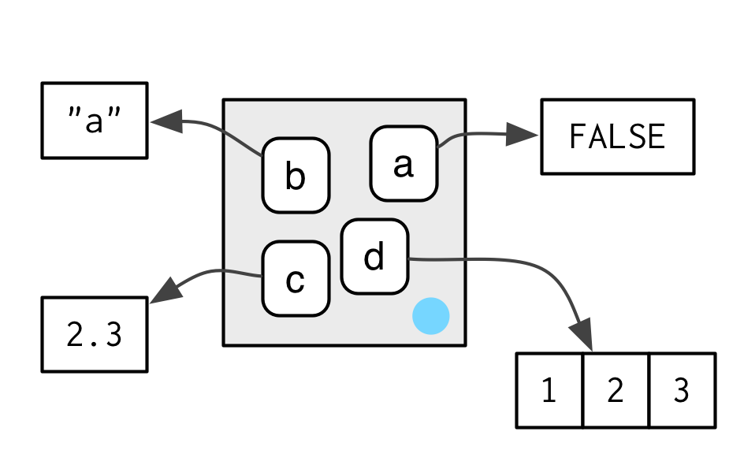
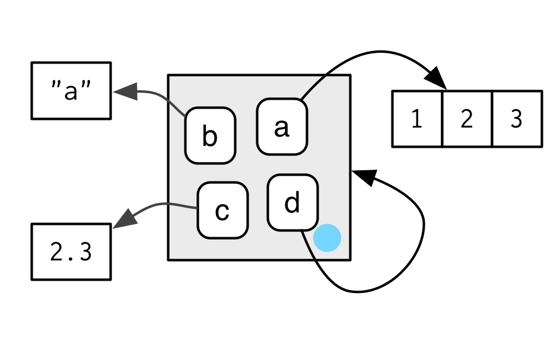
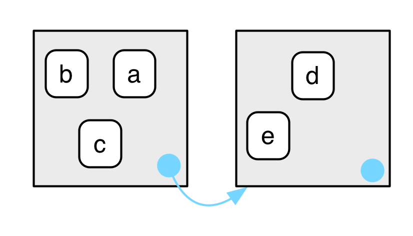
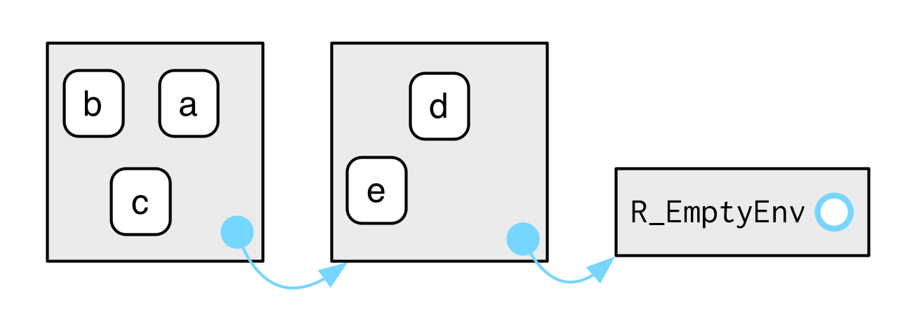

```{r, include=FALSE}
knitr::opts_chunk$set(tidy=TRUE, fig.align='center')
```

```{r, echo=FALSE, include=FALSE}
library(lobstr)
library(pryr)
library(knitr)
library(kableExtra)
library(magrittr)
library(dplyr)
library(tidyverse)
library(rlang)

# Some API changes that haven't made it in rlang yet
search_envs <- function() {
  rlang:::new_environments(c(
    list(global_env()),
    head(env_parents(global_env()), -1)
  ))
}
```

# Environments
The environment is the data structure that powers many important R features like lexical scoping, namespaces, and R6 classes, and interact with evaluation to give you powerful tools for making domain specific languages, like dplyr and ggplot2.

## Basics
Create a new environment using `new.env()`:
```{r}
e1 <- new.env() # base
e1$a <- FALSE
e1$b <- "a"
e1$c <- 2.3
e1$d <- 1:3

# rlang
e1 <- env(a = FALSE, b = "a", c = 2.3, d = 1:3)

names(e1)
env_names(e1) # rlang function
print(e1)
env_print(e1) # rlang function
typeof(e1)
class(e1)
attributes(e1)
```

The job of an environment is to associate, or bind, a set of names to a set of values.

```{r, out.width="400px", echo=FALSE}

```

Environments have reference semantics: unlike most R objects, when you modify them, you modify them in place, and don’t create a copy. One important implication is that environments can contain themselves.
```{r}
e1$d <- e1
env_print(e1)
```

One important implication is that environments can contain themselves.

```{r, out.width="400px", echo=FALSE}

```

TJC: diagram may be incorrect:
```{r}
e1$a # FALSE, not 1:3
```

There is essentially infinite nesting:

```{r}
env_print(e1)
env_print(e1$d)
e1$a
e1$d$a
e1$d$d$b
```

## Important environments
The current environment, or `current_env()` is the environment in which code is currently executing. When you’re experimenting interactively, that’s usually the global environment, or `global_env()`. The global environment is sometimes called your “workspace”, as it’s where all interactive (i.e. outside of a funtion) computation takes place.
```{r, error=TRUE}
environment() # base
current_env() # rlang

globalenv() # base
global_env() # rlang

identical(globalenv(), environment())
globalenv() == environment() # note, don't use ==
```

## Parents
Every environment has a **parent**, another environment. The parent is what’s used to implement lexical scoping: if a name is not found in an environment, then R will look in its parent (and so on).

You can set the parent environment by supplying an unnamed argument to 'env()', or setting providing the parent in `new.env()` . If you don’t supply it, it defaults to the current environment.

```{r}
e2a <- env(d = 4, e = 5)
e2b <- env(e2a, a = 1, b = 2, c = 3)
```

```{r, out.width="400px", echo=FALSE}

```

You can find the parent of an environment:
```{r}
parent.env(e2a) # base
env_parent(e2a) # rlang
parent.env(e2b) # base
env_parent(e2b) # rlang
```

Only one environment doesn’t have a parent: the **empty** environment.
```{r}
emptyenv() #base
empty_env() # rlang

e2c <- env(empty_env(), d = 4, e = 5)
e2d <- env(e2c, a = 1, b = 2, c = 3)
```

```{r, out.width="400px", echo=FALSE}

```

You’ll get an error if you try and find the parent of the empty environment:
```{r, error=TRUE}
parent.env(emptyenv()) # base
env_parent(empty_env()) # rlang
```

You can list all ancestors of an environment with `env_parents()`:
```{r}
env_parents(e2b) # rlang, no base equivalent
env_parents(e2d)
```

By default, `env_parents()` continues until it hits either the global environment or the empty environment. You can control this behaviour with the `last` environment.

## Getting and setting
You can get and set elements of an environment with `$` and `[[` in the same way as a list:
```{r}
e3 <- env(x = 1, y = 2)
e3$x

e3$z <- 3
e3[["z"]]
```

But you can’t use `[[` with numeric indices, and you can’t use `[`:
```{r, error=TRUE}
e3[[1]]
e3[c("x", "y")]
```

`$` and `[[` will return `NULL` if the binding does not exist. Use `env_get()` if you want an error or get a default value:
```{r, error=TRUE}
e3$xyz
env_get(e3, "xyz")
env_get(e3, "xyz", default = NA)
```


