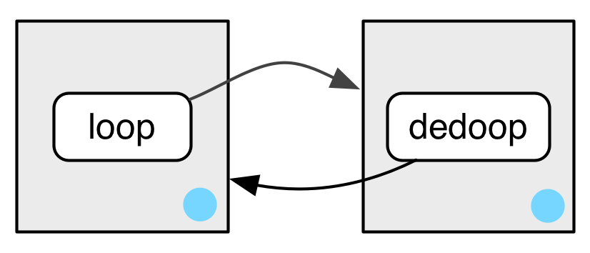
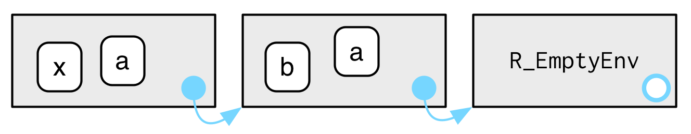

```{r, include=FALSE}
knitr::opts_chunk$set(tidy=TRUE, fig.align='center')
```

```{r, echo=FALSE, include=FALSE}
library(lobstr)
library(pryr)
library(knitr)
library(kableExtra)
library(magrittr)
library(dplyr)
library(tidyverse)
library(rlang)

# Some API changes that haven't made it in rlang yet
search_envs <- function() {
  rlang:::new_environments(c(
    list(global_env()),
    head(env_parents(global_env()), -1)
  ))
}
```

# Environments
The environment is the data structure that powers many important R features like lexical scoping, namespaces, and R6 classes, and interact with evaluation to give you powerful tools for making domain specific languages, like dplyr and ggplot2.

## Basics
Create a new environment using `new.env()`:
```{r}
e1 <- new.env() # base
e1$a <- FALSE
e1$b <- "a"
e1$c <- 2.3
e1$d <- 1:3

# rlang
e1 <- env(a = FALSE, b = "a", c = 2.3, d = 1:3)

names(e1)
env_names(e1) # rlang function
print(e1)
env_print(e1) # rlang function
typeof(e1)
class(e1)
attributes(e1)
```

The job of an environment is to associate, or bind, a set of names to a set of values.

```{r, out.width="400px", echo=FALSE}
knitr::include_graphics("Images/bindings.png")
```

The objects don’t live in the environment so multiple names can point to the same object:
```{r}
e1$b <- e1$d
```

```{r, out.width="400px", echo=FALSE}
knitr::include_graphics("Images/multiple-names.png")
```

Environments have reference semantics: unlike most R objects, when you modify them, you modify them in place, and don’t create a copy. One important implication is that environments can contain themselves.
```{r}
e1$d <- e1
env_print(e1)
```

```{r, out.width="400px", echo=FALSE}
knitr::include_graphics("Images/loop.png")
```

There is essentially infinite nesting:

```{r}
env_print(e1)
env_print(e1$d)
e1$a
e1$d$a
e1$d$d$b
```

## Important environments
The current environment, or `current_env()` is the environment in which code is currently executing. When you’re experimenting interactively, that’s usually the global environment, or `global_env()`. The global environment is sometimes called your “workspace”, as it’s where all interactive (i.e. outside of a funtion) computation takes place.
```{r, error=TRUE}
environment() # base
current_env() # rlang

globalenv() # base
global_env() # rlang

identical(globalenv(), environment())
globalenv() == environment() # note, don't use ==
```

## Parents
Every environment has a **parent**, another environment. The parent is what’s used to implement lexical scoping: if a name is not found in an environment, then R will look in its parent (and so on).

You can set the parent environment by supplying an unnamed argument to 'env()', or setting providing the parent in `new.env()` . If you don’t supply it, it defaults to the current environment.

```{r}
e2a <- env(d = 4, e = 5)
e2b <- env(e2a, a = 1, b = 2, c = 3)
```

```{r, out.width="400px", echo=FALSE}
knitr::include_graphics("Images/parents.png")
```

You can find the parent of an environment:
```{r}
parent.env(e2a) # base
env_parent(e2a) # rlang
parent.env(e2b) # base
env_parent(e2b) # rlang
```

Only one environment doesn’t have a parent: the **empty** environment.
```{r}
emptyenv() #base
empty_env() # rlang

e2c <- env(empty_env(), d = 4, e = 5)
e2d <- env(e2c, a = 1, b = 2, c = 3)
```

```{r, out.width="400px", echo=FALSE}
knitr::include_graphics("Images/parents-empty.png")
```

You’ll get an error if you try and find the parent of the empty environment:
```{r, error=TRUE}
parent.env(emptyenv()) # base
env_parent(empty_env()) # rlang
```

You can list all ancestors of an environment with `env_parents()`:
```{r}
env_parents(e2b) # rlang, no base equivalent
env_parents(e2d)
```

By default, `env_parents()` continues until it hits either the global environment or the empty environment. You can control this behaviour with the `last` environment.

## Getting and setting
You can get and set elements of an environment with `$` and `[[` in the same way as a list:
```{r}
e3 <- env(x = 1, y = 2)
e3$x

e3$z <- 3
e3[["z"]]
```

But you can’t use `[[` with numeric indices, and you can’t use `[`:
```{r, error=TRUE}
e3[[1]]
e3[c("x", "y")]
```

`$` and `[[` will return `NULL` if the binding does not exist. Use `get()` or `env_get()` if you want an error or get a default value:
```{r, error=TRUE}
e3$xyz 
get("xyz", pos = e3) # base
env_get(e3, "xyz") # rlang
env_get(e3, "xyz", default = NA)
```

You can add bindings to an environment:

```{r}
# base
assign("a", 10, e3)
assign("b", 20, e3)
ls.str(e3)

# rlang
env_bind(e3, a = 10, b = 20)
```

You can determine if an environment has a binding:
```{r}
exists("x", e3) # base
env_has(e3, "x") # rlang
```

Unlike lists, setting an element to `NULL` does not remove it. In environments, that will create a new binding to `NULL`. Instead:
```{r}
# base
e4 <- new.env()
e4$a <- 1
e4$a <- NULL
ls(e4)
rm("a", envir = e4)
ls(e4)

# rlang
e4$a <- 1
ls(e4)
env_unbind(e4, "a")
ls(e4)
```

Unbinding a name doesn’t delete the object. That’s the job of the garbage collector, which automatically removes objects with no names binding to them.

Beware `get()`, `assign()`, and `exists()`. The `inherits` argument defaults to `TRUE` meaning that they  will inspect the supplied environment and all its ancestors.

## Advanced bindings
`delayedAssign()` creates delayed bindings, which are evaluated the first time they are accessed. Behind the scenes, delayed bindings create promises, so behave in the same way as function arguments.
```{r}
p1 <- {print("hi1"); 1}
delayedAssign("p2", {print("hi2"); 2})
p2
```

**Delayed bindings** are used to implement `autoload()`, which makes R behave as if the package data is in memory, even though it’s only loaded from disk when you ask for it.

The idea of an **active binding** is that you can define something that looks like a variable but it actually invokes a function each time it is accessed. `makeActiveBinding()` creates active bindings which are re-computed every time they’re accessed:
```{r}
x <- runif(1)
x
x
rm(x)

makeActiveBinding("x", function() runif(1), globalenv())
x
x
rm(x)
```

Active bindings can also be "set":
```{r}
f <- function(x) {
  if (missing(x)) {
    print("get")
  } else {
    print(paste("set", x))
  }
}

makeActiveBinding("y", f, globalenv())
y # "get" value
y <- 1 # "set" value
rm(y)
```

## Exercises
1. List three ways in which an environment differs from a list.  
**A**: The most important differences are:  

  * environments have reference semantics (they are modifed in place and can contain themselves)
  * environments have parents
  * environments are not ordered
  * elements of environments need to be (uniquely) named
  
2. Create an environment as illustrated by this picture.  
```{r, out.width="400px", echo=FALSE}
knitr::include_graphics("Images/recursive-1.png")
```
**A**:
    ```{r}
    e <- new.env()
    e$loop <- e
    ```

3. Create an environment as illustrated by this picture.  
```{r, out.width="400px", echo=FALSE}

```
**A**:
    ```{r}
    e1 <- new.env()
    e2 <- new.env()
    e1$loop <- e2
    e2$dedoop <- e1
    ```

4. Explain why `e[[1]]` and `e[c("a", "b")]` don’t make sense when e is an environment.  
**A**: Environments are not ordered; environments are not subsettable for multiple elements

## Recursing over environments
If you want to operate on every ancestor of an environment, it’s often convenient to write a recursive function. This section shows you how, applying your new knowledge of environments to write a function that given a name, finds the environment `where()` that name is defined, using R’s regular scoping rules.

The definition of `where()` is straightforward. It has two arguments: the name to look for (as a string), and the environment in which to start the search. (We’ll learn why `caller_env()` is a good default in calling environments.)
```{r, error=TRUE}
where <- function(name, env = caller_env()) {
  if (identical(env, empty_env())) {
    # Base case
    stop("Can't find ", name, call. = FALSE)
  } else if (env_has(env, name)) {
    # Success case
    env
  } else {
    # Recursive case
    where(name, env_parent(env))
  }
}

where("yyy")
x <- 5
where("x")
where("mean")
```

It might help to see a picture. Imagine you have two environments, as in the following code and diagram:
```{r}
e4a <- env(empty_env(), a = 1, b = 2)
e4b <- env(e4a, x = 10, a = 11)
```

```{r, out.width="400px", echo=FALSE}

```

* `where("a"", e4a)` will find `a` in `e4a`.
* `where("b", e4a)` doesn’t find `b` in `e4a`, so it looks in its parent, `e4b`, and finds it there.
* `where("c", e4a)` looks in `e4a`, then `e4b`, then hits the empty environment and throws an error.

```{r, error=TRUE}
where("a", e4a)
where("b", e4a)
where("c", e4a)
```

### Exercises
1. Modify `where()` to return all environments that contain a binding for name. Carefully think through what type of object the function will need to return.


