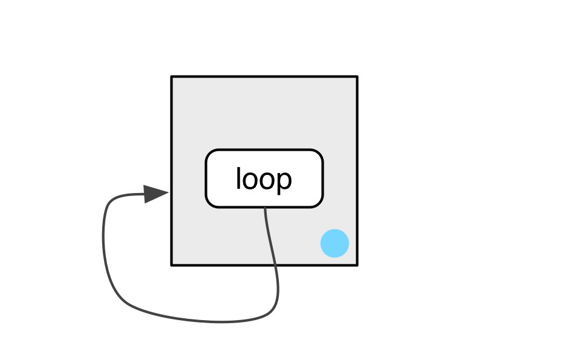
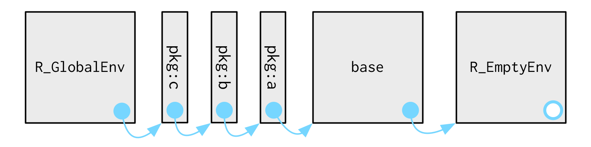
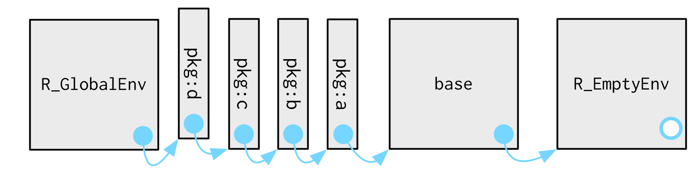
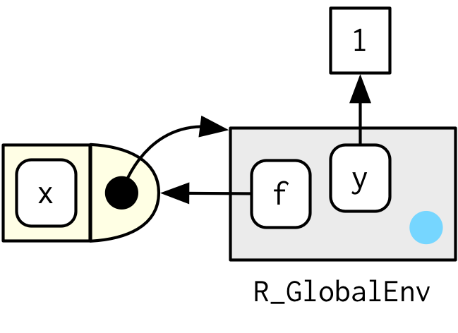
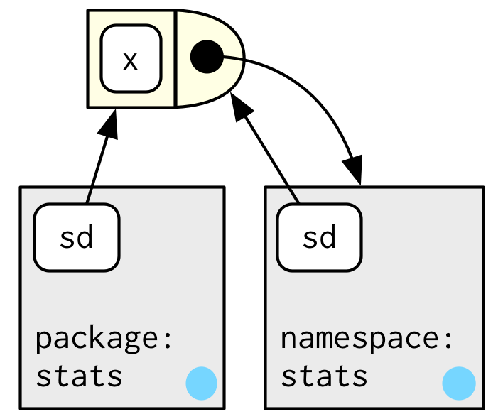

```{r, include=FALSE}
knitr::opts_chunk$set(tidy=TRUE, fig.align='center')
```

```{r, echo=FALSE, include=FALSE}
library(lobstr)
library(pryr)
library(knitr)
library(kableExtra)
library(magrittr)
library(dplyr)
library(tidyverse)
library(rlang)

# Some API changes that haven't made it in rlang yet
search_envs <- function() {
  rlang:::new_environments(c(
    list(global_env()),
    head(env_parents(global_env()), -1)
  ))
}
```

# Environments
The environment is the data structure that powers many important R features like lexical scoping, namespaces, and R6 classes, and interact with evaluation to give you powerful tools for making domain specific languages, like dplyr and ggplot2.

## Basics
Create a new environment using `new.env()`:
```{r}
e1 <- new.env() # base
e1$a <- FALSE
e1$b <- "a"
e1$c <- 2.3
e1$d <- 1:3

# rlang
e1 <- env(a = FALSE, b = "a", c = 2.3, d = 1:3)

names(e1)
env_names(e1) # rlang function
print(e1)
env_print(e1) # rlang function
typeof(e1)
class(e1)
attributes(e1)
```

The job of an environment is to associate, or bind, a set of names to a set of values.

```{r, out.width="400px", echo=FALSE}
knitr::include_graphics("Images/bindings.png")
```

The objects don’t live in the environment so multiple names can point to the same object:
```{r}
e1$b <- e1$d
```

```{r, out.width="400px", echo=FALSE}
knitr::include_graphics("Images/multiple-names.png")
```

Environments have reference semantics: unlike most R objects, when you modify them, you modify them in place, and don’t create a copy. One important implication is that environments can contain themselves.
```{r}
e1$d <- e1
env_print(e1)
```

```{r, out.width="400px", echo=FALSE}
knitr::include_graphics("Images/loop.png")
```

There is essentially infinite nesting:

```{r}
env_print(e1)
env_print(e1$d)
e1$a
e1$d$a
e1$d$d$b
```

## Important environments
The current environment, or `current_env()` is the environment in which code is currently executing. When you’re experimenting interactively, that’s usually the global environment, or `global_env()`. The global environment is sometimes called your “workspace”, as it’s where all interactive (i.e. outside of a funtion) computation takes place.
```{r, error=TRUE}
environment() # base
current_env() # rlang

globalenv() # base
global_env() # rlang

identical(globalenv(), environment())
globalenv() == environment() # note, don't use ==
```

## Parents
Every environment has a **parent**, another environment. The parent is what’s used to implement lexical scoping: if a name is not found in an environment, then R will look in its parent (and so on).

You can set the parent environment by supplying an unnamed argument to 'env()', or setting providing the parent in `new.env()` . If you don’t supply it, it defaults to the current environment.

```{r}
e2a <- env(d = 4, e = 5)
e2b <- env(e2a, a = 1, b = 2, c = 3)
```

```{r, out.width="400px", echo=FALSE}

```

You can find the parent of an environment:
```{r}
parent.env(e2a) # base
env_parent(e2a) # rlang
parent.env(e2b) # base
env_parent(e2b) # rlang
```

Only one environment doesn’t have a parent: the **empty** environment.
```{r}
emptyenv() #base
empty_env() # rlang

e2c <- env(empty_env(), d = 4, e = 5)
e2d <- env(e2c, a = 1, b = 2, c = 3)
```

```{r, out.width="400px", echo=FALSE}
knitr::include_graphics("Images/parents-empty.png")
```

You’ll get an error if you try and find the parent of the empty environment:
```{r, error=TRUE}
parent.env(emptyenv()) # base
env_parent(empty_env()) # rlang
```

You can list all ancestors of an environment with `env_parents()`:
```{r}
env_parents(e2b) # rlang, no base equivalent
env_parents(e2d)
```

By default, `env_parents()` continues until it hits either the global environment or the empty environment. You can control this behaviour with the `last` environment.

## Getting and setting
You can get and set elements of an environment with `$` and `[[` in the same way as a list:
```{r}
e3 <- env(x = 1, y = 2)
e3$x

e3$z <- 3
e3[["z"]]
```

But you can’t use `[[` with numeric indices, and you can’t use `[`:
```{r, error=TRUE}
e3[[1]]
e3[c("x", "y")]
```

`$` and `[[` will return `NULL` if the binding does not exist. Use `get()` or `env_get()` if you want an error or get a default value:
```{r, error=TRUE}
e3$xyz 
get("xyz", pos = e3) # base
env_get(e3, "xyz") # rlang
env_get(e3, "xyz", default = NA)
```

You can add bindings to an environment:

```{r}
# base
assign("a", 10, e3)
assign("b", 20, e3)
ls.str(e3)

# rlang
env_bind(e3, a = 10, b = 20)
```

You can determine if an environment has a binding:
```{r}
exists("x", e3) # base
env_has(e3, "x") # rlang
```

Unlike lists, setting an element to `NULL` does not remove it. In environments, that will create a new binding to `NULL`. Instead:
```{r}
# base
e4 <- new.env()
e4$a <- 1
e4$a <- NULL
ls(e4)
rm("a", envir = e4)
ls(e4)

# rlang
e4$a <- 1
ls(e4)
env_unbind(e4, "a")
ls(e4)
```

Unbinding a name doesn’t delete the object. That’s the job of the garbage collector, which automatically removes objects with no names binding to them.

Beware `get()`, `assign()`, and `exists()`. The `inherits` argument defaults to `TRUE` meaning that they  will inspect the supplied environment and all its ancestors.

## Advanced bindings
`delayedAssign()` creates delayed bindings, which are evaluated the first time they are accessed. Behind the scenes, delayed bindings create promises, so behave in the same way as function arguments.
```{r}
p1 <- {print("hi1"); 1}
delayedAssign("p2", {print("hi2"); 2})
p2
```

**Delayed bindings** are used to implement `autoload()`, which makes R behave as if the package data is in memory, even though it’s only loaded from disk when you ask for it.

The idea of an **active binding** is that you can define something that looks like a variable but it actually invokes a function each time it is accessed. `makeActiveBinding()` creates active bindings which are re-computed every time they’re accessed:
```{r}
x <- runif(1)
x
x
rm(x)

makeActiveBinding("x", function() runif(1), globalenv())
x
x
rm(x)
```

Active bindings can also be "set":
```{r}
f <- function(x) {
  if (missing(x)) {
    print("get")
  } else {
    print(paste("set", x))
  }
}

makeActiveBinding("y", f, globalenv())
y # "get" value
y <- 1 # "set" value
rm(y)
```

## Exercises
1. List three ways in which an environment differs from a list.  
**A**: The most important differences are:  

  * environments have reference semantics (they are modifed in place and can contain themselves)
  * environments have parents
  * environments are not ordered
  * elements of environments need to be (uniquely) named
  
2. Create an environment as illustrated by this picture.  
```{r, out.width="400px", echo=FALSE}

```
**A**:
    ```{r}
    e <- new.env()
    e$loop <- e
    ```

3. Create an environment as illustrated by this picture.  
```{r, out.width="400px", echo=FALSE}
knitr::include_graphics("Images/recursive-2.png")
```
**A**:
    ```{r}
    e1 <- new.env()
    e2 <- new.env()
    e1$loop <- e2
    e2$dedoop <- e1
    ```

4. Explain why `e[[1]]` and `e[c("a", "b")]` don’t make sense when e is an environment.  
**A**: Environments are not ordered; environments are not subsettable for multiple elements

## Recursing over environments
If you want to operate on every ancestor of an environment, it’s often convenient to write a recursive function. This section shows you how, applying your new knowledge of environments to write a function that given a name, finds the environment `where()` that name is defined, using R’s regular scoping rules.

The definition of `where()` is straightforward. It has two arguments: the name to look for (as a string), and the environment in which to start the search. (We’ll learn why `caller_env()` is a good default in calling environments.)
```{r, error=TRUE}
where <- function(name, env = caller_env()) {
  if (identical(env, empty_env())) {
    # Base case
    stop("Can't find ", name, call. = FALSE)
  } else if (env_has(env, name)) {
    # Success case
    env
  } else {
    # Recursive case
    where(name, env_parent(env))
  }
}

where("yyy")
x <- 5
where("x")
where("mean")
```

It might help to see a picture. Imagine you have two environments, as in the following code and diagram:
```{r}
e4a <- env(empty_env(), a = 1, b = 2)
e4b <- env(e4a, x = 10, a = 11)
```

```{r, out.width="400px", echo=FALSE}

```

* `where("a"", e4a)` will find `a` in `e4a`.
* `where("b", e4a)` doesn’t find `b` in `e4a`, so it looks in its parent, `e4b`, and finds it there.
* `where("c", e4a)` looks in `e4a`, then `e4b`, then hits the empty environment and throws an error.

```{r, error=TRUE}
where("a", e4a)
where("b", e4a)
where("c", e4a)
```

### Exercises
1. Modify `where()` to return all environments that contain a binding for name. Carefully think through what type of object the function will need to return.
```{r}
where_all <- function(name, env = caller_env()) {
  if (identical(env, empty_env())) {
    # do nothing
  } else if (env_has(env, name)) {
    # Success case
    c(env, where_all(name, env_parent(env)))
  } else {
    # Recursive case
    where_all(name, env_parent(env))
  }
}

e1 <- env(empty_env(), x = 1)
attr(e1, "name") <- "e1"

e2 <- env(e1, x = 2)
attr(e2, "name") <- "e2"

x <- 3

where_all("x", e1)
where_all("x", e2)
where_all("x")

where_all("y", e1)

# NOTE:
c("a", c("b", c("C")))
```

2. Write a function called `fget()` that finds only function objects. It should have two arguments, name and env, and should obey the regular scoping rules for functions: if there’s an object with a matching name that’s not a function, look in the parent. For an added challenge, also add an inherits argument which controls whether the function recurses up the parents or only looks in one environment.
```{r}
fget <- function(name, env = caller_env(), inherits = TRUE) {
  if (identical(env, empty_env())) {
    # do nothing
  } else if (env_has(env, name) && is.function(env[[name]])) {
    # Success case
    c(env[[name]], fget(name, env_parent(env)))
  } else {
    # Recursive case
    if (inherits) fget(name, env_parent(env)) else NULL
  }
}

e1 <- env(empty_env(), x = mean)
attr(e1, "name") <- "e1"

e2 <- env(e1, x = 2)
attr(e2, "name") <- "e2"

x <- 3

fget("x", e1)
fget("x", e2)
fget("x", e2, inherits = FALSE)
fget("x")

fget("y", e1)
```

## Special environments
Most environments are not created by you (e.g. with `env()`) but are instead created by R. In this section, you’ll learn about the most important environments, starting with the package environments. You’ll then learn about the function environment bound to the function when it is created, and the (usually) ephemeral execution environment created every time the function is called. Finally, you’ll see how the package and function environments interact to support namespaces, which ensure that a package always behaves the same way, regardless of what other packages the user has loaded.

### Package environments and the search path
Each package attached by `library()` or `require()` becomes one of the parents of the global environment. The immediate parent of the global environment is the last package you attached:
```{r}
parent.env(globalenv()) # base
env_parent(global_env()) # rlang
```

If you follow all the parents back, you see the order in which every package has been attached. This is known as the **search path** because all objects in these environments can be found from the top-level interactive workspace.
```{r}
search()
```

The last two environments on the search path are always the same:

* The `Autoloads` environment uses delayed bindings to save memory by only loading package objects (like big datasets) when needed.
* The base environment, `package:base` or sometimes just `base`, is the environment of the base package. It is special because it has to be able to bootstrap the loading of all other packages. You can access it directly with `baseenv()` or `base_env()`.

Graphically, the search path looks like this:
```{r, out.width="400px", echo=FALSE}

```

When you attach another package with `library()`, the parent environment of the global environment changes:
```{r, out.width="400px", echo=FALSE}

```

### The function environment
A function binds the current environment when it is created. This is called the **function environment** (or enclosing environment?), and is used for **lexical scoping**. Across computer languages, functions that capture their environments are called **closures**, which is why this term is often used interchangeably with function in R’s documentation.

You can get the function environment:
```{r}
y <- 1
f <- function(x) x + y
environment(f) # base
fn_env(f) # rlang
```

In diagrams, I’ll depict functions as rectangles with a rounded end that binds an environment.
```{r, out.width="200px", echo=FALSE}

```

In this case, `f()` binds the environment that binds the name `f` to the function. But that’s not always the case: in the following example `g` is bound in a new environment `e`, but `g()` binds the global environment. The distinction between binding and being bound by is subtle but important; the difference is how we find `g` vs. how `g()` finds its variables.
```{r}
e <- new.env()
attr(e, "name") <- "e"
e$g <- function() x # binding environment is e, enclosing is global
environment(e$g) 
pryr::where("g", e)

x <- 2 
e$x <- 3
e$g() # returns 2 as function (enclosing) environment is the global

environment(e$g) <- e
e$g() # returns 2 as function environment is e
```

```{r, out.width="200px", echo=FALSE}
knitr::include_graphics("Images/binding-2 (1).png")
```

As seen above, you can change the enclosing environment. It is the enclosing environment of a function from a package you cannot change. In that case you don't change the enclosing environment, you actually create a copy in the new environment:

```{r}
ls(pattern = "sd")
environment(sd)
environment(sd) <- globalenv()
environment(sd)
ls(pattern = "sd")
find("sd") # find the binding environment 
pryr::where("sd") # not same as pryr::where which return first env only
rm(sd)
environment(sd)
```

Consider this:

```{r}
f <- sd
environment(f)
find("f")
```

The enclosing environment is still the namespace ''stats''. That's where the function is created. However, the binding environment is now the global environment. That's where the name "f" is bound to the object.

### Namespaces
In the diagram above, you saw that the parent environment of a package varies based on what other packages have been loaded. This seems worrying: doesn’t that mean that the package will find different functions if packages are loaded in a different order? The goal of namespaces is to make sure that this does not happen, and that every package works the same way regardless of what packages are attached by the user.

For example, take `sd()`:
```{r}
sd
```

`sd()` is defined in terms of `var()`, so you might worry that the result of `sd()` would be affected by any function called `var()` either in the global environment, or in one of the other attached packages.

R avoids this problem by taking advantage of the function (used for lexical scoping) vs. binding environment described above. Every function in a package is associated with a pair of environments: the package environment, which you learned about earlier, and the namespace environment.

* The package environment is the external interface to the package. It’s how you, the R user, find a function in an attached package or with `::`. Its parent is determined by search path, i.e. the order in which packages have been attached.(Binding environment)

* The namespace environment is the internal interface to the package. The package environment controls how we find the function; the namespace controls how the function finds its variables.(Enclosing/function environment)

Every binding in the package environment is also found in the namespace environment; this ensures every function can use every other function in the package. But some bindings only occur in the namespace environment. These are known as internal or non-exported objects, which make it possible to hide internal implementation details from the user.

```{r, out.width="200px", echo=FALSE}

```

`sd` is bound in both the `package:stats` and `namespace:stats` environments, but `sd()` binds the `namespace:stats` environment. 

Every namespace environment has the same set of ancestors:

* Each namespace has an **imports** environment that contains bindings to all the functions used by the package. The imports environment is controlled by the package developer with the `NAMESPACE` file.
*
* Explicitly importing every base function would be tiresome, so the parent of the imports environment is the base namespace. The base namespace contains the same bindings as the base environment, but it has different parent.

* The parent of the base namespace is the global environment. This means that if a binding isn’t defined in the imports environment the packge will look for it in the usual way. This is usually a bad idea (because it makes code depend on other loaded packages), so `R CMD check` automatically warns about such code. It is needed primarily for historical reasons, particularly due to how S3 method dispatch works

```{r, out.width="400px", echo=FALSE}
knitr::include_graphics("Images/namespace-env.png")
```

Putting all these diagrams together we get:
```{r, out.width="400px", echo=FALSE}
knitr::include_graphics("Images/namespace.png")
```
Note that there’s no direct link between the package and namespace environments; the link is defined by the function environments.

#### Don't do this!
But consider this, in which we also change the enclosing environment of the copied `sd()` to the global environment!!
```{r}
environment(sd)
find("sd")
sd(1:3)

environment(sd) <- globalenv()
environment(sd) # enclosing environment
find("sd") # find the binding environment 
globalenv()$sd(1:3) # or just sd() as global env is first in search path

# sd() uses var() - redefine var in the global environment!
# This is hackish and dangerouus!
var <- function(x, na.rm = TRUE) 100
globalenv()$sd(1:3)
stats::sd(1:3)

rm(var)
rm(sd)
environment(sd)
```

See https://stackoverflow.com/questions/44427752/distinct-enclosing-environment-function-environment-etc-in-r for some good information.


