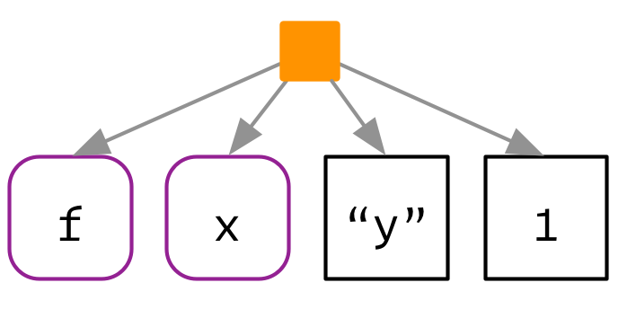

```{r, include=FALSE}
knitr::opts_chunk$set(tidy=TRUE, fig.align='center')
```

```{r, echo=FALSE, include=FALSE}
library(lobstr)
library(pryr)
library(knitr)
library(kableExtra)
library(magrittr)
library(dplyr)
library(tidyverse)
library(rlang)
library(memoise)
library(purrr)
```

# Expressions
It would be nice if we could capture the intent of the code, without executing the code. In other words, how can we separate our description of the action from performing it? One way is to use `rlang::expr()`:

```{r}
z <- expr(y <- x * 10)
z
typeof(z)
class(z)
str(z)

u <- quote(y <- x * 10)
u
typeof(u)
class(u)
str(u)
```

`expr()` returns a quoted expression: the R code that captures our intent.

## Abstract syntax trees
Quoted expressions are also called abstract syntax trees (AST).  To make that more obvious we’re going to introduce some graphical conventions, illustrated with the very simple call `f(x, "y", 1)`.

```{r, out.width="200px", echo=FALSE}

```

* Function **calls** define the hierarchy of the tree. Calls are shown with an orange square. The first child (`f`) is the function that gets called; the second and subsequent children (`x`, `"y"`, and `1`) are the arguments.

* The leaves of the tree are either **symbols**, like `f` and `x`, or **constants** like `1` or `"y"`. Symbols have a purple border and rounded corners. Constants, which are atomic vectors of length one, have black borders and square corners. Strings are always surrounded in quotes to emphasise their difference from symbols.

```{r}
lobstr::ast(f(x, "y", 1))
```

`ast()` supports “unquoting” with `!!` (pronounced bang-bang). We’ll talk about unquoting in detail in the next chapter; for now note that it’s useful if you’ve already used `expr()` to capture the expression.

```{r}
x <- expr(f(x, "y", 1))

# not useful!
lobstr::ast(x)
#> x

# what we want
lobstr::ast(!!x)
```

### Infix vs. prefix calls
In R, any infix call can be converted to a prefix call if you escape the function name with backticks. That means that these two lines of code are equivalent:

```{r, eval=FALSE, tidy=FALSE}
y <- x * 10
`<-`(y, `*`(x, 10))
```

```{r}
lobstr::ast(y <- x * 10)
lobstr::ast(`<-`(y, `*`(x, 10)))
```

### Special forms
R has a small number of other syntactical constructs that don’t look like either prefix or infix function calls. These are called special forms and include `function`, the control flow operators (`if`, `for`, `while`, `repeat`), and parentheses (`{`, `(`, `[[`, and `[`). These can also be written in prefix form, and hence appear in the same way in the AST:

```{r}
lobstr::ast(function(x, y) {
  if (x > y) {
    x
  } else {
    y
  }
})
```

### Function factories
Another small detail we need to consider are calls like `f()()`. The first component of the call is usually a symbol:

```{r}
lobstr::ast(f(a, 1))
lobstr::ast(f()(a, 1))
lobstr::ast(f(b, 2)(a, 1))
```

### Argument names
So far the examples have only used unnamed arguments. Named arguments don’t change the parsing rules, but just add some additional metadata:

```{r}
lobstr::ast(mean(x = mtcars$cyl, na.rm = TRUE))
```

## R's grammar
The process by which a computer language takes a sequence of tokens (like `x`, +, `y`) and constructs a tree is called **parsing**, and it is governed by a set of rules known as a **grammar**.

### Operator precedence
Infix functions introduce ambiguity in a way that prefix functions do not. The parser has to resolve two sources of ambiguity when parsing infix operators. First, what does `1 + 2 * 3` yield? Programming langauges use conventions called **operator precedence** to resolve this ambiguity.

```{r}
lobstr::ast(1 + 2 * 3)
```

Predicting the precedence of arithmetic operations is usually easy because it’s drilled into you in school and is consistent across the vast majority of programming languages. Predicting the precedence of other operators is harder. There’s one particularly surprising case in R: `!` has a much lower precedence (i.e. it binds less tightly) than you might expect. This allows you to write useful operations like:

```{r}
lobstr::ast(!x %in% y)
```

### Associativity
Another source of ambiguity is introduced by repeated usage of the same infix function. For example, is `1 + 2 + 3` equivalent to `(1 + 2) + 3` or to `1 + (2 + 3)`? This normally doesn’t matter because `x + (y + z) == (x + y) + z`, i.e. addition is associative, but is needed because some S3 classes define `+` in a non-associative way.

In R, most operators are left-associative, i.e. the operations on the left are evaluated first:
```{r}
lobstr::ast(1 + 2 + 3)
```

There are two exceptions: exponentiation and assignment.

```{r}
lobstr::ast(2 ^ 3 ^ 4)
lobstr::ast(x <- y <- z)
```

### Exercises
1. R uses parentheses in two slightly different ways as illustrated by these two calls:
    ```{r, eval=FALSE}
    f((1))
    `(`(1 + 1)
    ```
Compare and contrast the two uses by referencing the AST.
**A**: `(` can represent a primitive function but also be a part of R’s general prefix function syntax.
    ```{r}
    lobstr::ast(f((1)))
    lobstr::ast(`(`(1 + 1))
    
    lobstr::ast(f(1)) # same as lobstr::ast(f((1)))
    lobstr::ast(1 + 1)
    lobstr::ast((1 + 1)) # bracket appears as not part of function syntax
    ```

2. `=` can also be used in two ways. Construct a simple example that shows both uses.  
**a**: `=` can be used for assignment or two match to named arguments.
    ```{r}
    lobstr::ast(x = 1) # just the leaf 1
    lobstr::ast(x = (a = 1))
    lobstr::ast((a = 1)) # same as one above
    ```

3. What does `!1 + !1` return? Why?  
    ```{r}
    !1 + !1
    !(1 + (!1)) # same as above
    lobstr::ast(!1 + !1)
    (!1) + (!1) # = 0 as is FALSE + FALSE
    ```

4. Why does `x1 <- x2 <- x3 <- 0` work? There are two reasons.  
**A**: `<-` is right associative. Assignment returns the value being assigned.
    ```{r}
    lobstr::ast(x1 <- x2 <- x3 <- 0)
    lobstr::ast(0 -> x3 -> x2 -> x3)
    ```

5. Compare the ASTs `x + y %+% z` and `x ^ y %+% z`. What does that tell you about the precedence of custom infix functions?  
**A**: Custom infix functions have a precedence between addition and exponentiation
    ```{r}
    lobstr::ast(x + y %+% z)
    lobstr::ast(x ^ y %+% z)
    ```

## Data structures
In this section you’ll learn about the data structures that appear in the AST:

* Constants and symbols form the leaves of the tree.
* Calls form the branches of the tree.
* Pairlists are a largely historical data structure that are now only used for function arguments.

### Naming conventions
Before we continue, a word of caution about the naming conventions used in this book. Because base R evolved organically, it does not have a set of names that are used consistently throughout all functions. Instead, we’ve adopted our own set of conventions, and used them consistently throughout the book and in rlang. You will need to remember some translations when reading base R documentation.

The biggest difference is the use of the term “expression”. We use expression to refer to the set containing **constants**, **symbols**, **calls**, and **pairlists**. In base R, “expression” is a special type that is basically equivalent to a list of what we call expressions. To avoid confusion we’ll call these expression objects, and we’ll discuss them in expression objects. Base R does not have an equivalent term for our “expression”. The closest is “language object”, which includes symbols and calls, but not constants or pairlists.

But note that `typeof()` and `str()` use “language” not for language objects, but instead to mean calls. Base R uses symbol and name interchangeably; we prefer symbol because “name” has other common meanings (e.g. the name of a variable).

### Constants
Constants occurred in the leaves of the AST. They are the simplest data structure found in the AST because they are atomic vectors of length 1. Constants are “self-quoting” in the sense that the expression used to represent a constant is the constant itself:

```{r}
identical(expr("x"), "x")
identical(expr(TRUE), TRUE)
identical(expr(1), 1)
identical(expr(2), 2)
```

### Symbols
Symbols represent variable names. They are basically a single string stored in a special way. You can convert back and forth between symbols and the strings that represent them with `sym()` and `as_string()`:

```{r}
"x"
sym("x")
class(sym("x"))
typeof(sym("x"))
as_string(sym("x"))

class(quote(x))
typeof(quote(x))
identical(sym("x"), quote(x))
```

There’s one special symbol that needs a little extra discussion: the empty symbol which is used to represent missing arguments (not missing values!). You can make it with `missing_arg()` (or `expr()`):

```{r}
missing_arg()
typeof(missing_arg())
as_string(missing_arg())

# how to get missing arg in base R
quote(f(,))[[2]]
identical(missing_arg(), quote(f(,))[[2]])
is_missing(missing_arg())
```

This symbol has a peculiar property: if you bind it to a variable, then access that variable, you will get an error:

```{r, error=TRUE}
m1 <- missing_arg()
m1 # error
```

But you won’t get an error if it’s stored inside another data structure!

```{r, error=TRUE}
m2 <- list(missing_arg())
m2[[1]] # no error - empty argument

m3 <- m2[[1]]
m3 # error
```

This is the magic that makes missing arguments work in functions. If you do need to work with a missing argument stored in a variable, you can use `rlang::maybe_missing()`:

```{r, error=TRUE}
maybe_missing(m1)
maybe_missing

m1 <- missing_arg()
m1
m2 <- m1 # error
m2 <- maybe_missing(m1) # empty argument
```

You only need to care about the missing symbol if you’re programmatically creating functions with missing arguments.

### Calls
Calls define the tree in AST. A call behaves similarly to a list:

* It has a `length()`.
* You can extract elements with `[[`, `[`, and `$`.
* Calls can contain other calls.

The main difference is that the first element of a call is special: it’s the function that will get called. Let’s explore these ideas with a simple example:

```{r}
x <- expr(read.table("important.csv", row = FALSE))
lobstr::ast(!!x)

typeof(x)
class(x)
```

The length of a call minus one gives the number of arguments:

```{r}
length(x) - 1
```

The names of a call are empty, except for named arguments:

```{r}
names(x)
```

You can extract the leaves of the call by position and by name using `[[` and `$` in the usual way:

```{r}
x[[1]]
x[[2]]
x$row
```

Extracting specific arguments from calls is challenging because of R’s flexible rules for argument matching: it could potentially be in any location, with the full name, with an abbreviated name, or with no name. To work around this problem, you can use `rlang::call_standardise()` which standardises all arguments to use the full name:

```{r}
rlang::call_standardise(x)
```

(Note that if the function uses `...` it’s not possible to standardise all arguments.)

You can use `[` to extract multiple components, but if you drop the the first element, you’re going to end up with a weird call:

```{r}
x[2:3]
```

If you do want to extract multiple elements in this way, it’s good practice to coerce the results to a list:

```{r}
as.list(x[2:3])
```

Calls can be modified in the same way as lists:
```{r}
x$header <- TRUE
x
```

You can construct a call from its children by using `rlang::lang()`. The first argument should be the function to be called (supplied either as a string or a symbol), and the subsequent arguments are the call to that function:

```{r}
lang("mean", x = expr(x), na.rm = TRUE)
lang(expr(mean), x = expr(x), na.rm = TRUE)
```

### Pairlists
There is one data structure we need to discuss for completeness: the pairlist. Pairlists are a remnant of R’s past and have been replaced by lists almost everywhere. The only place you are likely to see pairlists in R is when working with function arguments:

```{r}
f <- function(x = 10) x + 1
formals(f)
typeof(formals(f))
class(formals(f))
```

(If you’re working in C, you’ll encounter pairlists more often. For example, calls are also implemented using pairlists.)

Fortunately, whenever you encounter a pairlist, you can treat it just like a regular list:

```{r}
pl <- pairlist(x = 1, y = 2)
length(pl)
pl$x
```

### Expression objects
Finally, we need to briefly discuss the expression object. Expression objects are produced by only two base functions: `expression()` and `parse()`:

```{r}
exp1 <- parse(text = "x <- 4 \n x")
exp1
typeof(exp1)
length(exp1)
exp1[[1]]
exp1[[2]]
typeof(exp1[[1]])

x1 <- expr(x <- 4)
typeof(x1)
identical(exp1[[1]], x1)

exp2 <- expression(x <-4, x)
exp2
```

Conceptually, an expression object is just a list of expressions. The only difference is that calling `eval()` on an expression evaluates each individual expression. We don’t believe this advantage merits introducing a new data structure, so instead of expression objects we always use regular lists of expressions.

```{r}
eval(exp1)
```

### Examples
```{r}
e1 <- expression(a + 1)
e1[[1]]
e1[[1]][[1]]
e1[[1]][[2]]
e1[[1]][[3]]
is.expression(e1)
is.call(e1[[1]])
is.expression(e1[[1]])
is.symbol(e1[[1]][[1]])
is.symbol(e1[[1]][[2]])
is.numeric(e1[[1]][[3]])

q1 <- quote(a + 1)
typeof(q1)
mode(q1)
class(q1)
identical(q1, e1[[1]])

# is.language(x) returns TRUE if x is a name (symbol), call or an expression
is.language(e1)
is.language(e1[[1]])
is.language(e1[[1]][[1]])
is.language(e1[[1]][[2]])
is.language(e1[[1]][[3]]) # FALSE, 1 is a constant
```

and this:

```{r}
e2<- expression(function(x) x)
q2 <- quote(function(x) x)

q2[[1]]
typeof(q2[[1]])

q2[[2]]
typeof(q2[[2]])


q2[[3]]
typeof(q2[[3]])

q2[[4]]
class(q2[[4]])
str(q2[[4]])

identical(q2, e2[[1]])
q2[[4]] <- NULL # srcref for function
e2[[1]][[4]] <- NULL # srcref for function
identical(q2, e2[[1]])
```


### Exercises
1. Which two of the six types of atomic vector can’t appear in an expression? Why? Why can’t you create an expression that contains an atomic vector of length greater than one?  
**A**: Raw and Complex are not self quoting. A call to a function is needed to construct a vector longer than length 1.
    ```{r}
    is.atomic(1 + 2i) # true
    is.atomic(expr(1 + 2i)) # false
    identical(1 + 2i, expr(1 + 2i)) # false
    identical(1, expr(1))  # true
    
    is.call(1 + 2i) # false
    lobstr::ast(1 + 2i)
    
    is.atomic(as.raw(2)) # true
    is.atomic(expr(as.raw(2))) # false
    lobstr::ast(raw(2))
    identical(1, expr(1))  # true
    
    ######################################

    lobstr::ast(1L)
    lobstr::ast(1:1)
    
    identical(1L, 1:1)
    
    is.atomic(expr(1L)) # true
    is.atomic(expr(1:1)) # false
    
    is.call(expr(1L)) # false
    is.call(expr(1:1)) # true
    ```

2. How is `rlang::maybe_missing()` implemented? Why does it work?  
**A**: obvious from code:
    ```{r}
    maybe_missing
    ```

3. `rlang::call_standardise()` doesn’t work so well for the following calls. Why? What makes `mean()` special?  
    ```{r, eval=FALSE}
    call_standardise(quote(mean(1:10, na.rm = TRUE)))
    #> mean(x = 1:10, na.rm = TRUE)
    call_standardise(quote(mean(n = T, 1:10)))
    #> mean(x = 1:10, n = T)
    call_standardise(quote(mean(x = 1:10, , TRUE)))
    #> mean(x = 1:10, , TRUE)
    ```
**A**: `mean()` uses `...` after only one named argument - `mean(x, ...)`. It works better on `mean.default()` - `mean(x, trim = 0, na.rm = FALSE, ...)`.
    ```{r}
    call_standardise(quote(mean.default(1:10, na.rm = TRUE)))
    call_standardise(quote(mean.default(n = T, 1:10)))
    call_standardise(quote(mean.default(x = 1:10, , TRUE)))
    ```

4. Why does this code not make sense?
    ```{r, eval=FALSE}
    x <- expr(foo(x = 1))
    names(x) <- c("x", "")
    ```
**A**: The first element of a call is always the function that gets called.
    ```{r}
    x <- expr(foo(x = 1))
    names(x) <- c("x", "")
    x
    
    names(x) <- c("", "x")
    x
    ```

5. Construct the expression `if(x > 1) "a" else "b"` using multiple calls to `lang()`. How does the structure code reflect the structure of the AST?  
**A**:
    ```{r}
    y <- call2('if', expr(x > 1), "a", "b")
    y
    lobstr::ast(!!y)
    
    x <- 2
    eval(y)
    x <- 0
    eval(y)
    ```

### Parsing and deparsing
Most of the time you type code into the console, and R takes care of turning the characters you’ve typed into an AST. But occasionally you have code stored in a string, and you want to parse it yourself. You can do so using `rlang::parse_expr()`:

```{r}
x1 <- "y <- x + 10"
lobstr::ast(!!x1)

x2 <- rlang::parse_expr(x1)
x2
typeof(x2)
lobstr::ast(!!x2)
```

If you have multiple expressions in a string, you’ll need to use `rlang::parse_exprs()`. It returns a list of expressions:

```{r}
x3 <- "a <- 1; a + 1"
rlang::parse_exprs(x3)
```

The base equivalent to `parse_exprs()` is `parse()`. It is a little harder to use because it’s specialised for parsing R code stored in files. That means you need supply your string to the text argument, and you get back an expression object:

```{r}
parse(text = x1)[[1]]
typeof(parse(text = x1))
```

The opposite of parsing is **deparsing**: you have an AST and you want a string that would generate it when parsed:

```{r}
z <- expr(y <- x + 10)
expr_text(z)
```

Parsing and deparsing are not perfectly symmetric because parsing throws away all information not directly related to the AST. This includes backticks around ordinary names, comments, and whitespace. The base R equivalent is `deparase()`.

### Exercises
1. What happens if you attempt to parse an invalid expression? e.g. `"a +"` or `"f())"`.  
**A**: an error occurs
    ```{r, error=TRUE}
    parse_expr("a +")
    parse(text = "a +")[[1]]
    ```

2. `deparse()` produces vectors when the input is long. For example, the following call produces a vector of length two:
    ```{r}  
    expr <- expr(g(a + b + c + d + e + f + g + h + i + j + k + l + m +
                   n + o + p + q + r + s + t + u + v + w + x + y + z))

    deparse(expr)
    ```
What do `expr_text()`, `expr_name()`, and `expr_label()` do with this input?  
**A**: `expr_text()` pastes the output string into one and inserts `\n` (new line identifiers) as separators. `expr_name()` recreates the call into the form `f(…)` and deparses this expression into a string. `expr_label()` does the same as `expr_name()`, but surrounds the output also with backticks. 
    ```{r}  
    expr_text(expr)
    cat(expr_text(expr))
    expr_name(expr)
    expr_label(expr)
    ```

3. Why does `as.Date.default()` use `substitute()` and `deparse()`? Why does `pairwise.t.test()` use them? Read the source code.  
**A**: In order to get the name of the object assigned to the argument `x`. `pairwise.t.test()` combines `x` "and" `g` using names passed to arguments.

4. `pairwise.t.test()` assumes that `deparse()` always returns a length one character vector. Can you construct an input that violates this expectation? What happens?


substitute
substitute_q
SubstututeDirect

enquote
deparse
delayedAssign
call
recall
all.names
do.call
function
is.language etc
bquote
sQuote, dQuote, Quotes, shQuote
missing
eval
getParseData
srcfile


