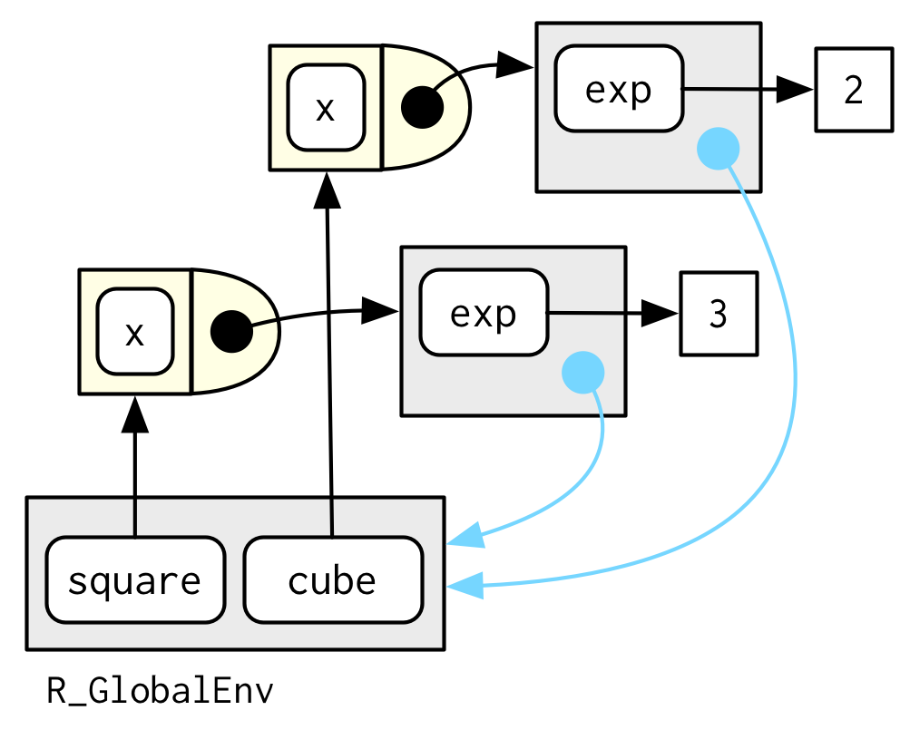

```{r, include=FALSE}
knitr::opts_chunk$set(tidy=TRUE, fig.align='center')
```

```{r, echo=FALSE, include=FALSE}
library(lobstr)
library(pryr)
library(knitr)
library(kableExtra)
library(magrittr)
library(dplyr)
library(tidyverse)
library(rlang)
```

# Function factories
## Introduction
A function factory is a function that makes functions. Here’s a simple example: we use a function factory (`power1()`) to make two child functions (`square()` and `cube()`). You have seen all the components individual before; what’s new is that we have a function that returns a function:

```{r}
power1 <- function(exp) {
  force(exp)
  
  function(x) {
    x ^ exp
  }
}

square <- power1(2)
cube <- power1(3)
```

`square()` and `cube()` are regular functions so we can call them as usual:

```{r}
square(2)
square(4)

cube(2)
cube(4)
```

## Factory fundamentals
### Environments
The key idea is that enclosing environment of function produced by the factory is the execution environment of the factory function. Here, the enclosing environment of `square()` and `cube()` are the execution environments of `power1()`. That means when you print a closure, you don’t see anything terribly useful:

```{r}
square
cube
```

The body of the function is identical; the difference is the enclosing environment, `environment(square)` and `nvironment(cube)`, which contain the values bound to `exp`. We can see that the value of `exp` in the two enclosing environments is different:

```{r}
environment(square)$exp
environment(cube)$exp
```

```{r, out.width="400px", echo=FALSE}

```

### Garbage collection
The execution environment is usually ephemeral, but because functions bind their enclosing argument, that reference will keep the execution environment alive until the child function is GC’d. This property makes function factories work, but requires a little care when you have more complicated code, as it’s easy to accidentally capture large variables that you don’t actually care about. Fir example, in the following code, f2() is large because its environment contains the million element vector `x`, even though it’s never actually used:

```{r}
f1 <- function() {
  x <- 1:1e6
  function() 10
}
lobstr::obj_size(f1)

f2 <- f1()
lobstr::obj_size(f2)

rm(f2)
```

### Exercises
1. Create a function `pick()` that takes an index, `i`, as an argument and returns a function with an argument `x` that subsets `x` with `i`.

    ```{r}
    pick <- function(i) {
    force(i)
    function(x) x[[i]]
  }

  lapply(mtcars, pick(5))
  lapply(mtcars, function(x) x[[5]])
    ```

## Mutable state with `<<-`
Having variables at two levels allows you to maintain state across function invocations. This is possible because while the execution environment is refreshed every time, the enclosing environment is constant. The key to managing variables at different levels is the double arrow assignment operator (`<<-`). Unlike the usual single arrow assignment (`<-`) that always assigns in the current environment, the double arrow operator will keep looking up the chain of parent environments until it finds a matching name.

Together, a static parent environment and `<<-` make it possible to maintain state across function calls. The following example shows a counter that records how many times a function has been called. Each time `new_counter` is run, it creates an environment, initialises the counter `i` in this environment, and then creates a new function.

```{r}
new_counter <- function() {
  i <- 0
  function() {
    i <<- i + 1
    i
  }
}

counter_one <- new_counter()
counter_two <- new_counter()
```

The enclosing environments of `counter_one()` and `counter_two()` are indepedent because they are the execution environments of `new_counter()` (which is different each time it’s called). Ordinarily, function execution environments are temporary, but a closure maintains access to the environment in which it was created. In the example below, closures `counter_one()` and `counter_two()` each get their own enclosing environments when run, so they can maintain different counts.

```{r}
counter_one()
counter_one()
counter_two()
```

The counters get around the “fresh start” limitation by not modifying variables in their execution environment, but in their enclosing environment.

Modifying values in a parent environment is an important technique because it is one way to generate “mutable state” in R. Mutable state is normally hard because every time it looks like you’re modifying an object, you’re actually creating and then modifying a copy. However, if you do need mutable objects and your code is not very simple, it’s usually better to use R6.

### Exercises
1. What happens if you don’t use a closure? Make predictions then verify with the code below.

    ```{r}
    i <- 0
    new_counter2 <- function() {
      i <<- i + 1
      i
    }
    ```
The enclosing environments are not independent (they are both the global environment)
    ```{r}
    new_counter2()
    new_counter2()
    new_counter2()
    ```

2. What happens if you use `<-` instead of `<<-`? Make predictions then verify with the code below.

    ```{r}
    new_counter3 <- function() {
      i <- 0
      function() {
        i <- i + 1
        i
      }
    }
    ```
Restarts each time it is called.
    ```{r}
    counter3_one <- new_counter3()
    counter3_two <- new_counter3()
    
    counter3_one()
    counter3_one()
    counter3_two()
    ```

## Function factories + functionals
Easily create a bunch of functions at once.

```{r}
names <- list(
  square = 2, 
  cube = 3, 
  root = 1/2, 
  cuberoot = 1/3, 
  reciprocal = -1
)
funs <- purrr::map(names, power1)
funs$root(64)
```


