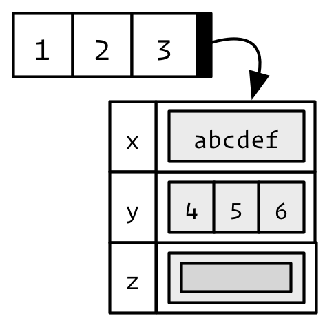
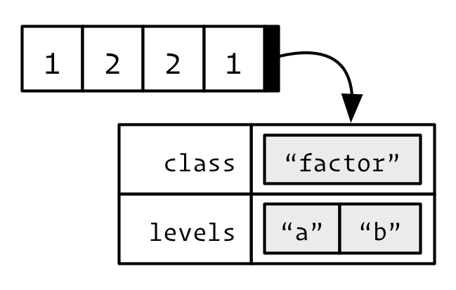
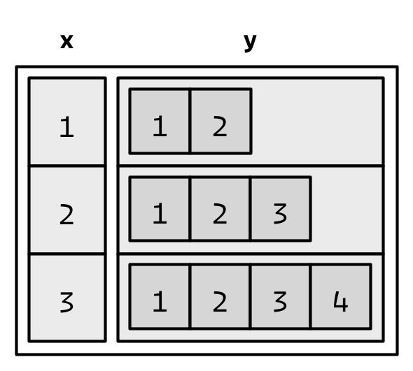
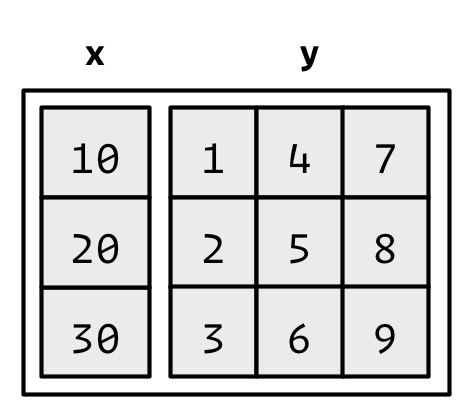

```{r, include=FALSE}
knitr::opts_chunk$set(tidy=TRUE, results='hold', fig.align='center')
```

```{r, echo=FALSE, include=FALSE}
library(lobstr)
library(pryr)
library(knitr)
library(kableExtra)
library(magrittr)
library(dplyr)
```

# Vectors
Vectors can be organized by their dimension (1d, 2d, nd) and whether they're all homogeneous or heterogeneous. This gives rise to the five types most often used in data analysis:

Dimension     | Homogeneous   | Heterogeneous
------------- | ------------- | -------------
1d            | Atomic vector | List
2d            | Matrix        | Data frame
nd            | Array         |

Note that R has no 0-dimensional, or scalar types. Individual numbers or strings are vectors of length one.

Vectors come in two flavours:

* Atomic vectors
* Lists

```{r, out.width="200px", echo=FALSE}
knitr::include_graphics("Images/summary.png")
```

They have three common properties:

* Type, `typeof()`, what it is.
* Length, `length()` how many elementd it contains.
* Attributes, `attributes()`, additional arbitrary metadata.

All elementd of an atomic vector must be the same type, whereas the elements of a list can have different types.

## Atomic vectors
There are 6 types of atomic vectors:

* Logical
* Integer
* Double
* Character
* Complex - used for complex arithmetic
* Raw - intended to hold raw bytes

```{r}
dbl_var <- c(1, 2.5, 4.5)
int_var <- c(1L, 6L, 10L)
log_var <- c(TRUE, FALSE, T, F)
chr_var <- c("these are","some strings")
```

```{r, out.width="200px", echo=FALSE}
knitr::include_graphics("Images/Atomic.png")
```

Atomic vectors are always flat, even if you nest with `c()`'s:

```{r}
c(1, c(2, c(3,4)))
# the same as
c(1, 2, 3, 4)
```

Missing values are specified with `NA`, which is a logical vector of length 1. `NA` will always be coerced to the correct type if used inside `c()`, or you can create `NA`s of the correct type with `NA_real_`, `NA_integer_` and `NA_character_`.

### Types and tests
Given a vector, you can determine its type with `typeof()`.

Use "is" functions with care. `is.character()`, `is.double()`, `is.integer()` and `is.logical()` are ok. The following are surprising:

* `is.vector()` tests for vectors with no attributes apart from names (this is probably because matrices and arrays have a dim attribute). Use `is.atomic() || is.list()` to test if an object is actually a vector.
* `is.atomic()` tests for atomic vectors or `NULL`.
* `is.numeric()` tests for the numerical-ness of a vector - returns true if the type is an integer or a double, but not a factor. 

```{r}
int_var <- c(1L, 6L, 10L)
typeof(int_var)
```
```{r}
null_var <- NULL
is.atomic(null_var)
typeof(null_var)
```
```{r}
v <- c(x=1, y=2, z=3)
attributes(v)
is.vector(v)
```
```{r}
attr(v, "t") <- "test"
attributes(v)
is.vector(v)
is.atomic(v)
```
```{r}
is.numeric(1)
is.numeric(1L)
is.numeric("1")
```
```{r}
v = c(1,2,2,3,1,2,3,3,1,2,3,3,1)
is.numeric(v)
typeof(v)
class(v)
```
```{r}
fv = factor(v)
fv
is.numeric(fv)
typeof(fv)
class(fv)
```

### Coercion
All elements of an atomic vector must be of the same type  and, if necessary, are coerced to the most flexible one. Types from least to most flexible are: logical, integer, double, character.

```{r}
str(c("a", 1L))
```

When a logical vector is coerced to a numeric, `TRUE` becomes `1` and `FALSE` becomes `0`. This is useful in conjunction with `sum()` and `mean()`.
```{r}
x <- c(FALSE, FALSE, TRUE)
as.numeric(x)

sum(x) # total number of TRUEs
mean(x) # proportion of TRUEs
```

Coercion often occurs automatically. Explicit coercion can be done with `as.character()`, `as.double()`, `as.integer()`, and `as.logical()`. `as.numeric()` is identical to `as.double()`.

## Lists
Lists are different from atomic vectors because their elements can be of any type, including lists.

```{r}
x <- list(1:3, "a", c(TRUE, FALSE, TRUE), c(2.3, 5.9))
str(x)
```

```{r, out.width="200px", echo=FALSE}
knitr::include_graphics("Images/list1.png")
```

Lists are sometimes called **recursive** vectors because they can contain other lists.

```{r}
x <- list(list(list(list(1))))
str(x)
is.recursive(x)
```

`c()` will combine several lists into one. If given a combination of atomic vectors and lists, `c()` will coerce the vectors to lists before combining them.

```{r}
x <- list(list(1, 2), c(3, 4))
str(x)
```
```{r}
y <- c(list(1, 2), c(3, 4))
str(y)
```

```{r, out.width="200px", echo=FALSE}
knitr::include_graphics("Images/list-c.png")
```

The `typeof()` a list is list. You can test for a list with `is.list()` and coerce to a list with `as.list()`. You can turn a list into an atomic vector with `unlist()`. If the elements of a list have different types, `unlist()` uses the same coercion rules as `c()`.

```{r}
x <- list(list(1, 2), c("a", "b"))
typeof(x)
is.list(x)
str(unlist(x))
```

## `NULL`
`NULL` is a singleton object often used to represent a vector of length 0.

```{r}
typeof(NULL)
length(NULL)
```

## Exercises
1. What are the 6 types of atomic vectors? How does a list differ from an atomic vector?  
**A**: raw, logical, integer, double, complex, character. A list can have elements of different types.

2. What makes `is.vector()` and `is.numeric()` fundamentally different from `is.list()` and `is.character()`?  
**A**: The first two do not check for specific types.

3. Test your knowledge of vector coercion rules by predicting the output of the following uses of `c()`:  
```
c(1, FALSE)      
c("a", 1)        
c(list(1), "a")  
c(TRUE, 1L)      
```
**A**: will be coerced to double, character, list with 2 elements of double and character, integer.
    ```{r}
    str(c(1, FALSE))      
    str(c("a", 1))        
    str(c(list(1), "a"))  
    str(c(TRUE, 1L))
    ```

4. Why do you need to use `unlist()` to convert a list to an atomic vector? Why doesn’t `as.vector()` work?  
**A**: A list is a vector.  
    ```{r, results='markup'}
    l <- list(1, list(2, 3))
    l
    is.vector(l)
    as.vector(l)
    unlist(l)
    ```

5. Why is `1 == "1"` true? Why is `-1 < FALSE` true? Why is `"one" < 2` false?  
**A**: `1` is coerced to `"1"`. `FALSE` is coerced to `0`. `2` is coerced to `"2"` - `“one”` comes after `“2”` in ASCII.

6. Why is the default missing value, `NA`, a logical vector? What’s special about logical vectors? (Hint: think about `c(FALSE, NA_character_)`.)  
**A**: A logical type can be coerced to any type.

## Attributes
All objects can have arbitrary additional attributes, used to store additional metadata. Attributes can be thought of as a (unique) named list. Attributes can be accessed individually with `attr()` or all at once with `attributes()`.

```{r}
a <- 1:3
attr(a, "x") <- "abcdef"
attr(a, "y") <- 4:6
attr(a, "z") <- list(list())
str(attributes(a))
```

```{r, out.width="200px", echo=FALSE}

```

The `structure()` function returns a new object with modified attributes.

```{r}
structure(1:10, my_attribute = "This is a vector")
```

By default, most attributes are lost when modifying a vector.

```{r, results='markup'}
attributes(a)
attributes(a[1])
attributes(sum(a))
```

The only attributes not lost are the three most important ones:

* Names

* Dimensions

* Class

Each of these attributes has a specific accessor function to get and set values, `names()`, `dim()`, and `class()`.

### Names
You can name a vector in 2 ways:

* When creating it: `x <- c(a = 1, b = 2, c = 3)`.

* By modifying an existing vector:
    ```{r, results='hide'}
    x <- 1:3  
    names(x) <- c("a", "b", "c")
    x <- setNames(1:3, c("a", "b", "c"))
    ```

Names don’t have to be unique. However, character subsetting is the most important reason to use names and it is most useful when the names are unique.

Not all elements of a vector need to have a name. Depending on how you create the vector the missing names will either have value `""` or `NA_character_`. If all names are missing, `names()` will return `NULL`. You remove names from an existing vector using `unname(x)` or `names(x) <- NULL`.

## Factors
Attributes are used to define factors. A factor is a vector that can only contain predefined values, and is used to store categorical data. Factors are built upon integer vectors using two attributes:

* the `class`, "factor", which makes them behave differently from regular integer vectors, and

* the `levels`, which defines the set of allowed values.

```{r, results='markup'}
x <- factor(c("a", "b", "b", "a"))
x
typeof(x)
attributes(x)
```

```{r, out.width="200px", echo=FALSE}

```

Factors are useful when you know the possible values a variable may take, even if you don’t see all values in a given dataset. Using a factor instead of a character vector makes it obvious when some groups contain no observations:

```{r}
sex_char <- c("m", "m", "m")
table(sex_char)
```
```{r}
sex_factor <- factor(sex_char, levels = c("m", "f"))
table(sex_factor)
```

While factors look like (and often behave like) character vectors, they are actually integers. Be careful when treating them like strings. Some string methods (like `gsub()` and `grepl()`) will coerce factors to strings, while others (like `nchar()`) will throw an error, and still others (like `c()`) will use the underlying integer values. For this reason, it’s usually best to explicitly convert factors to character vectors if you need string-like behaviour.

```{r}
x <- factor(c("a", "b", "b", "a"))
x
as.character(x)
as.integer(x)
```

## Exercises
1. An early draft used this code to illustrate structure(): `structure(1:5, comment = "my attribute")`. But when you print that object you don’t see the comment attribute. Why?  
**A**: From the help of comment, `?comment`: the comment attribute is not printed. Also from the help of attributes `?attributes`: Note that some attributes (namely `class`, `comment`, `dim`, `dimnames`, `names`, `row.names` and `tsp`) are treated specially and have restrictions on the values which can be set.
    ```{r, results='markup'}
    x <- 1:3  
    comment(x) <- "Hello"
    x # comment is not printed to screen
    attributes(x)
    attributes(x[1]) # attribute is not retained
    ```

2. What happens to a factor when you modify its levels?  
    ```{r}
    f1 <- factor(letters)
    levels(f1) <- rev(levels(f1))
    ```
**A**: Both the entries and the levels are reversed.
    ```{r, results='markup'}
    f1 <- factor(letters)
    f1
    levels(f1) <- rev(levels(f1))
    f1
    f1[1] # levels are retained
    ```

3. What does this code do? How do `f2` and `f3` differ from `f1`?  
    ```{r, results='hide'}
    f2 <- rev(factor(letters))
    f3 <- factor(letters, levels = rev(letters))
    ```
**A**:
    ```{r, results='markup'}
    f2 # only entries are reversed
    f3 # only levels are reversed
    ```
    
Note that replacing the levels via `levels(x) <- value` is not the same as `attr(x, "levels") <- value`. For the `levels()` function, a `NA` in `value` causes that level to be removed from the levels.
```{r, results='markup'}
f1 <- factor(letters[1:3])
levels(f1) <- c("a", "b", NA)
f1
f2 <- factor(letters[1:3])
attr(f2, "levels") <- c("a", "b", NA)
f2
```


## Matrices and arrays
Adding a `dim` attribute to an atomic vector allows it to behave like a multi-dimensional array. A special case of the array is the matrix, which has two dimensions.

Matrices and arrays are created with `matrix()` and `array()`, or by using the assignment form of `dim()`:
```{r}
a <- matrix(1:6, nrow = 2, ncol = 3)
a
is.array(a)
is.matrix(a)
```

```{r}
b <- array(1:12, c(2, 3, 2))
b
is.array(b)
is.matrix(b)
```

```{r}
c <- 1:6
dim(c) <- c(2, 3)
c
```

```{r}
d <- 1:12
dim(d) <- c(2, 3, 2)
d
```

`length()` and `names()` have high-dimensional generalisations:

* `length()` generalises to `nrow()` and `ncol()` for matrices, and `dim()` for arrays.

* `names()` generalises to `rownames()` and `colnames()` for matrices, and `dimnames()`, a list of character vectors, for arrays.

### Length
```{r}
a <- matrix(1:6, nrow = 2, ncol = 3)
a
length(a)
nrow(a)
ncol(a)
dim(a)
```

```{r}
b <- array(1:12, c(2, 3, 2))
b
length(b)
dim(b)
```

```{r, results='markup'}
a <- matrix(1:6, nrow = 2, ncol = 3)
dim(a) <- c(3,2) # change to 3 x 2
a
dim(a) <- c(1, 6)
a # still a matrix
dim(a) <- NULL
a # now a vector
```

Note that `NROW` and `NCOL` also return the numbers of rows and columns but treat a vector as a 1-column matrix.

```{r}
nrow(a)
ncol(a)
NROW(a)
NCOL(a)
```

Also note the code:

```{r, results='markup'}
nrow
NROW
ncol
NCOL
```

Dimension attributes are retained when the object is modified:

```{r}
b <- array(1:12, c(2, 3, 2))
b[, 1:2, ]
dim(b[, 1:2, ])
```


### Names
```{r, results='markup'}
a <- matrix(1:6, nrow = 2, ncol = 3)
rownames(a) <- c("A", "B")
colnames(a) <- c("a", "b", "c")
a
names(a)
rownames(a)
colnames(a)
dimnames(a)
a %<>% unname()
dimnames(a) <- list(c("A", "B"), c("a", "b", "c"))
a
```

```{r}
b <- array(1:12, c(2, 3, 2))
dimnames(b) <- list(c("one", "two"), c("a", "b", "c"), c("A", "B"))
b
```

Name attributes are retained when the object is modified:

```{r, results='markup'}
c <- b[1:2, 1, ]
c
dim(c) # matrix
dimnames(c) # names are retained
```

```{r, results='markup'}
d <- b[1, 1, ]
d # note that d is a vector, not an array or matrix
dim(d)
dimnames(d)
names(d)
```

```{r, results='markup'}
e <- b[1, 1, , drop = FALSE] # don't drop dimensions
e # now an array
dim(e)
dimnames(e)
names(e)
```

### 1d structures
```{r, results='markup'}
str(1:3)                   # 1d vector
str(matrix(1:3, ncol = 1)) # column vector
str(matrix(1:3, nrow = 1)) # row vector
str(array(1:3, 3))         # "array" vector
```

### List matrices and arrays
While atomic vectors are most commonly turned into matrices, the dimension attribute can also be set on lists to make list-matrices or list-arrays:

```{r}
l <- list(1:3, "a", TRUE, 1.0)
dim(l) <- c(2, 2)
l
```

### Determining structure
Use `class()`, `is.matrix()`, `is.array()` and `str()`.

```{r}
a <- matrix(1:6, nrow = 2, ncol = 3)
class(a)
is.matrix(a) # checks if has dim attribute of length 2
str(a)
```

```{r}
b <- array(1:12, c(2, 3, 2))
class(b)
is.array(b)
str(b)
```

Note that a data frame is not a matrix.

```{r, results='markup'}
df <- data.frame(1:2, 3:4)
df
dim(df)
attributes(df) # no dim attribute
is.matrix(df)
is.data.frame(df)
```

### Exercises
1. What does `dim()` return when applied to a vector?  
**A**: `NULL`

2. When might you use `NROW()` or `NCOL()`?
**A**: When subsetting an array or matrix that might return a vector.

3. If `is.matrix(x)` is `TRUE`, what will `is.array(x)` return?
**A**: `TRUE`. A matrix is a 2d array.

4. How would you describe the following three objects? What makes them different to 1:5?
    ```
    x1 <- array(1:5, c(1, 1, 5))
    x2 <- array(1:5, c(1, 5, 1))
    x3 <- array(1:5, c(5, 1, 1))
    ```
**A**: They are arrays with a dim attribute.

## Data frames
Under the hood, a data frame is a list of equal-length vectors. This makes it a 2-dimensional structure, so it shares properties of both the matrix and the list.This means that a data frame has `names()`, `colnames()`, and `rownames()`, although `names()` and `colnames()` are the same thing. The `length()` of a data frame is the length of the underlying list and so is the same as `ncol()`; `nrow()` gives the number of rows. As described in subsetting, you can subset a data frame like a 1d structure (where it behaves like a list), or a 2d structure (where it behaves like a matrix).

### Creation
You create a data frame using `data.frame()`, which takes named vectors as input. Beware `data.frame()`’s default behaviour which turns strings into factors. Use `stringsAsFactors = FALSE` to suppress this behaviour:

```{r, results='markup'}
df <- data.frame(x = 1:3, y = c("a", "b", "c"), stringsAsFactors = FALSE)
str(df)
names(df)
colnames(df)
rownames(df)
length(df)
ncol(df)
nrow(df)
attributes(df)
```

### Testing and coercion
Because a `data.frame` is an S3 class, its type reflects the underlying vector used to build it: the list. To check if an object is a data frame, use `is.data.frame`():

```{r, results='markup'}
typeof(df)
class(df)
is.list(df)
is.data.frame(df)
```

You can coerce an object to a data frame with `as.data.frame()`:

* A vector will create a one-column data frame.

* A list will create one column for each element; it’s an error if they’re not all the same length.

* A matrix will create a data frame with the same number of columns and rows as the matrix.

* Arrays with more than two dimensions are converted to matrices by ‘flattening’ all dimensions after the first and creating suitable column labels.

```{r, results='markup'}
a <- array(1:12, c(2, 3, 2))
a
df <- as.data.frame(a)
df
```

### Combining data frames
You can combine data frames using `cbind()` and `rbind()`:

```{r, results='markup'}
df1 <- data.frame(x = 1:3, y = 4:6)
df2 <- data.frame(z = 7:9)
cbind(df1, df2)
df3 <- data.frame(x = 7, y = 8)
rbind(df1, df3)
```

When combining column-wise, the number of rows must match, but row names need not match: 

```{r, results='markup'}
df1 <- data.frame(x = 1:3, y = 4:6)
df2 <- data.frame(z = 7:9)
rownames(df1) <- c("a", "b", "C")
rownames(df2) <- c("d", "e", "f")
cbind(df1, df2)
rownames(df1) <- NULL
cbind(df1, df2)
```

When combining row-wise, both the number and names of columns must match. Use `dplyr::bind_rows()`, `data.table::rbindlist()`, or similar to combine data frames that don’t have the same columns.

```{r}
bind_rows(data.frame(x = 1:3), data.frame(y = 1:4))
```

### List and matrix columns
Since a data frame is a list of vectors, it is possible for a data frame to have a column that is a list. This is a powerful technique because a list can contain any other R object. This means that you can have a column of data frames, or model objects, or even functions!

```{r}
df <- data.frame(x = 1:3)
df$y <- list(1:2, 1:3, 1:4)
df
```

```{r, out.width="200px", echo=FALSE}

```

However, when a list is given to data.frame(), it tries to put each item of the list into its own column, so this fails:

```{r, error=TRUE, tidy=FALSE, cache=FALSE}
data.frame(x = 1:3, y = list(1:2, 1:3, 1:4))
```

A workaround is to use `I()`, which causes `data.frame()` to treat the list as one unit. `()` adds the AsIs class to its input

```{r, results='markup'}
df <- data.frame(x = 1:3, y = I(list(1:2, 1:3, 1:4)))
df
str(df)
attributes(df$y)
```

Similarly, it’s also possible to have a column of a data frame that’s a matrix or array, as long as the number of rows matches the data frame:

```{r}
dfm <- data.frame(x = 1:3 * 10, y = I(matrix(1:9, nrow = 3)))
str(dfm)
```

```{r, out.width="200px", echo=FALSE}

```

Use list and array columns with caution. Many functions that work with data frames assume that all columns are atomic vectors.


TO DO - put in mapping between typeof and mode and storage.mode
hierarachy: NULL < raw < logical < integer < double < complex < character < list < expression

