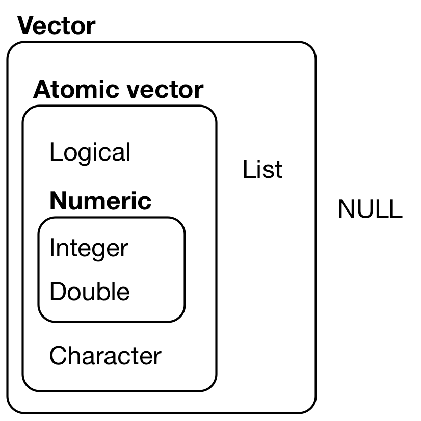
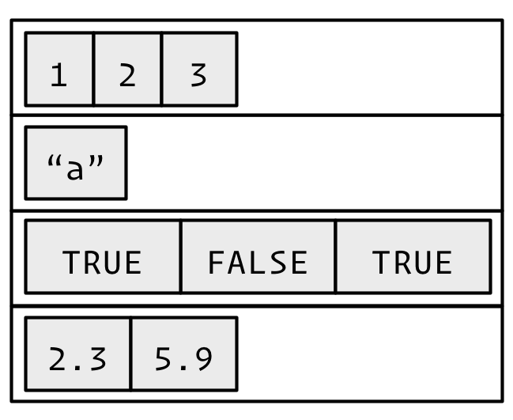
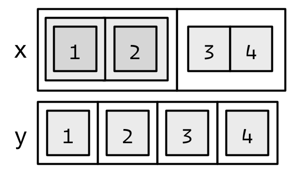

```{r, include=FALSE}
knitr::opts_chunk$set(tidy=TRUE, results='hold', fig.align='center')
```

```{r, echo=FALSE, include=FALSE}
library(lobstr)
library(pryr)
library(knitr)
library(kableExtra)
library(magrittr)

```

# Vectors
Vectors can be organized by their dimension (1d, 2d, nd) and whether they're all homogeneous or heterogeneous. This gives rise to the five types most often used in data analysis:

Dimension     | Homogeneous   | Heterogeneous
------------- | ------------- | -------------
1d            | Atomic vector | List
2d            | Matrix        | Data frame
nd            | Array         |

```{r, echo=FALSE}
d <- c("1d", "2d", "nd")
ho <- c("Atomic vector", "Matrix", "Array")
he <- c("List", "Data frame", "")
dt <- data.frame(Dimension = d, Homogeneous = ho, Heterogeneous = he, stringsAsFactors = FALSE)
kable(dt) %>%
  kable_styling(bootstrap_options = c("condensed", "hover"), full_width = FALSE, position = "left")
```

Note that R has no 0-dimensional, or scalar types. Individual numbers or strings are vectors of length one.

Vectors come in two flavours:

* Atomic vectors
* Lists

```{r, out.width="200px", echo=FALSE}

```

They have three common properties:

* Type, `typeof()`, what it is.
* Length, `length()` how many elementd it contains.
* Attributes, `attributes()`, additional arbitrary metadata.

All elementd of an atomic vector must be the same type, whereas the elements of a list can have different types.

## Atomic vectors
There are 6 types of atomic vectors:

* Logical
* Integer
* Double
* Character
* Complex - used for complex arithmetic
* Raw - intended to hold raw bytes

```{r}
dbl_var <- c(1, 2.5, 4.5)
int_var <- c(1L, 6L, 10L)
log_var <- c(TRUE, FALSE, T, F)
chr_var <- c("these are","some strings")
```

```{r, out.width="200px", echo=FALSE}
knitr::include_graphics("Images/Atomic.png")
```

Atomic vectors are always flat, even if you nest with `c()`'s:

```{r}
c(1, c(2, c(3,4)))
# the same as
c(1, 2, 3, 4)
```

Missing values are specified with `NA`, which is a logical vector of length 1. `NA` will always be coerced to the correct type if used inside `c()`, or you can create `NA`s of the correct type with `NA_real_`, `NA_integer_` and `NA_character_`.

### Types and tests
Given a vector, you can determine its type with `typeof()`.

Use "is" functions with care. `is.character()`, `is.double()`, `is.integer()` and `is.logical()` are ok. The following are surprising:

* `is.vector()` tests for vectors with no attributes apart from names. Use `is.atomic() || is.list()` to test if an object is actually a vector.
* `is.atomic()` tests for atomic vectors or `NULL`.
* `is.numeric()` tests for the numerical-ness of a vector - returns true if the type is an integer or a double, but not a factor. 

```{r}
int_var <- c(1L, 6L, 10L)
typeof(int_var)
```
```{r}
null_var <- NULL
is.atomic(null_var)
typeof(null_var)
```
```{r}
v <- c(x=1, y=2, z=3)
attributes(v)
is.vector(v)
```
```{r}
attr(v, "t") <- "test"
attributes(v)
is.vector(v)
is.atomic(v)
```
```{r}
is.numeric(1)
is.numeric(1L)
is.numeric("1")
```
```{r}
v = c(1,2,2,3,1,2,3,3,1,2,3,3,1)
is.numeric(v)
typeof(v)
class(v)
```
```{r}
fv = factor(v)
fv
is.numeric(fv)
typeof(fv)
class(fv)
```

### Coercion
All elements of an atomic vector must be of the same type  and, if necessary, are coerced to the most flexible one. Types from least to most flexible are: logical, integer, double, character.

```{r}
str(c("a", 1L))
```

When a logical vector is coerced to a numeric, `TRUE` becomes `1` and `FALSE` becomes `0`. This is useful in conjunction with `sum()` and `mean()`.
```{r}
x <- c(FALSE, FALSE, TRUE)
as.numeric(x)

sum(x) # total number of TRUEs
mean(x) # proportion of TRUEs
```

Coercion often occurs automatically. Explicit coercion can be done with `as.character()`, `as.double()`, `as.integer()`, and `as.logical()`. `as.numeric()` is identical to `as.double()`.

## Lists
Lists are different from atomic vectors because their elements can be of any type, including lists.

```{r}
x <- list(1:3, "a", c(TRUE, FALSE, TRUE), c(2.3, 5.9))
str(x)
```

```{r, out.width="200px", echo=FALSE}

```

Lists are sometimes called **recursive** vectors because they can contain other lists.

```{r}
x <- list(list(list(list(1))))
str(x)
is.recursive(x)
```

`c()` will combine several lists into one. If given a combination of atomic vectors and lists, `c()` will coerce the vectors to lists before combining them.

```{r}
x <- list(list(1, 2), c(3, 4))
str(x)
```
```{r}
y <- c(list(1, 2), c(3, 4))
str(y)
```

```{r, out.width="200px", echo=FALSE}

```

The `typeof()` a list is list. You can test for a list with `is.list()` and coerce to a list with `as.list()`. You can turn a list into an atomic vector with `unlist()`. If the elements of a list have different types, `unlist()` uses the same coercion rules as `c()`.

```{r}
x <- list(list(1, 2), c("a", "b"))
typeof(x)
is.list(x)
str(unlist(x))
```

## `NULL`
`NULL` is a singleton object often used to represent a vector of length 0.

```{r}
typeof(NULL)
length(NULL)
```


TO DO - put in mapping between typeof and mode and storage.mode
hierarachy: NULL < raw < logical < integer < double < complex < character < list < expression

